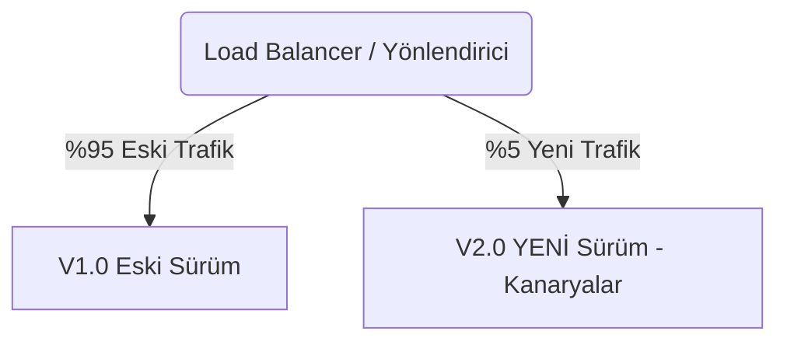

# Bölüm 06: Dağıtım (Deployment) Stratejileri

CI/CD sürecinin sonunda kodun canlı sunucuya (Production) alınması gerekir. Milyonlarca kişinin kullandığı bir sitede "Sistemi durdur, yeni kodu yükle, sistemi başlat" derseniz o 10 dakikalık kesintide şirket milyonlarca dolar kaybeder. 

Kesintisiz (Zero Downtime) ve güvenli geçiş için şu stratejiler (genellikle Kubernetes yardımıyla) kullanılır:

---

## 1. Rolling Update (Kademeli Güncelleme)
Mevcut sunucuları (veya Pod'ları) hep birden kapatmak yerine, teker teker güncelleyen stratejidir. Kubernetes'in varsayılan (Default) taktiğidir.

**Süreç:** Elimizde 3 sunucu varsa; önce 1. sunucuyu kapatır, yeni versiyonu yükler ve açar. O çalışırken diğer 2 sunucu müşterilere cevap vermeye devam eder. Sonra 2. sunucuya geçer. Sistemde saniye bile kesinti olmaz.

## 2. Blue-Green Deployment (Mavi-Yeşil Dağıtım)
En güvenli ama en pahalı sistemdir. Çünkü mevcut canlı sunucuların (Mavi) birebir aynısından bir kopya (Yeşil) daha inşa etmenizi gerektirir (2 kat maliyet).

```mermaid
graph TD
    User(Müşteriler / Load Balancer) --> |Trafik %100| Blue[Mavi Sistem - Eski Versiyon v1.0]
    User -.-> |Trafik %0| Green[Yeşil Sistem - YENİ Versiyon v2.0]
    
    subgraph Değişim Anı (Switch)
        Note(Testler bittikten sonra Load Balancer <br>tek tuşla tüm trafiği Yeşil'e aktarır)
    end
```

**Süreç:** Yeni kod (v2.0) hiç trafik almayan Yeşil sisteme yüklenir. Şirket içi tester'lar Yeşil sistemi canlıda denerler. Her şey kusursuzsa "Yönlendirici (Load Balancer)" tek tuşla Müşteri trafiğini Mavi'den kesip Yeşil'e bağlar. Hata çıkarsa 1 saniye içinde tekrar Mavi'ye geri dönülebilir (Rollback).

## 3. Canary Release (Kanarya Dağıtımı)
Adını eski madencilerin zehirli gazı önden test etmek için madene kanarya kuşu salmasından alır. Yeni versiyonun (V2.0) doğrudan tüm müşterilere değil, **sadece müşterilerin küçük bir yüzdesine (%5'ine)** açılmasıdır.



**Süreç:** Sisteme giren müşterilerin %5'i (veya sadece İzmir'den bağlananlar) şans eseri yeni tasarıma (v2.0) düşerler. Arka planda loglar (hatalar) incelenir. Eğer o %5'lik kesimde çökmeler artmazsa oran %10'a, %50'ye ve sonunda %100'e çekilerek yavaş ve aşırı güvenli bir geçiş sağlanır. (Instagram ve YouTube arayüz güncellemelerini hep böyle yapar).
