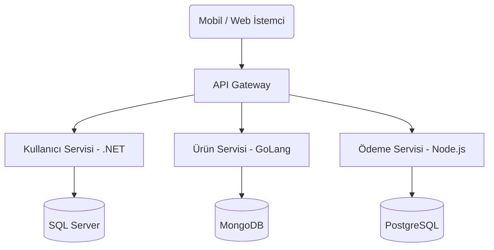
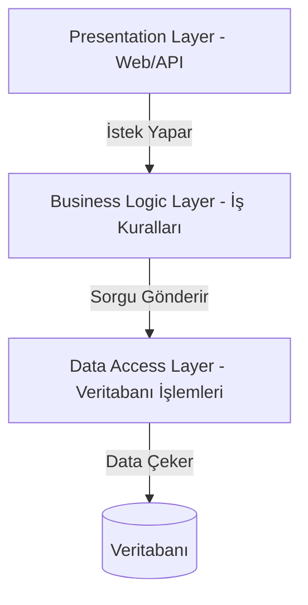

# Bölüm 17: Yazılım Mimarileri (Design Architectures)

Bir projenin hangi klasörlerden oluşacağı, dosyaların birbirleriyle nasıl konuşacağı ve projenin 5 yıl sonra büyüdüğünde çöküp çökmeyeceği tamamen seçtiğiniz Mimari (Architecture) yaklaşıma bağlıdır.

---

## 1. Monolitik (Monolithic) vs Mikroservis (Microservices)

En tepedeki karar, sistemin tek parça mı yoksa çok parçalı mı olacağıdır.

### A. Monolitik Mimari
Tüm kodların (Kullanıcılar, Ürünler, Sepet, Ödeme) aynı projenin içinde yer aldığı geleneksel yapıdır.
- **Avantaj:** Geliştirmesi, test etmesi ve sunucuya yüklemesi çok basittir.
- **Dezavantaj:** Proje çok büyüdüğünde bir yerdeki hata tüm sistemi çökertebilir. Sepet modülü çok trafik aldığında, mecburen tüm projeyi (Kullanıcılar dahil) kopyalayıp çoğaltmanız gerekir.

### B. Mikroservis Mimarisi
Her bir iş biriminin (Ürün Servisi, Ödeme Servisi, Kullanıcı Servisi) **ayrı birer küçük proje** olduğu ve kendi aralarında ağ üzerinden (HTTP/RabbitMQ) haberleştiği devasa yapıdır.



- **Avantaj:** Sadece çok yorulan servisi ölçekleyebilirsiniz (Örn: Sadece Ürün servisini 5 bilgisayarda çalıştır). Her servis farklı bir dille (C#, Python, Go) yazılabilir.
- **Dezavantaj:** Yönetimi çok zordur (Dağıtık mimari, veri tutarlılığı, Docker/Kubernetes zorunluluğu).

---

## 2. N-Tier (Çok Katmanlı) Mimari
Monolitik bir projenin iç yapısını klasörlere/kütüphanelere bölen klasik mimaridir. Genellikle 3 katmandan oluşur.
Katmanlar **sadece bir altındaki katmanla** iletişim kurabilir. UI doğrudan DataAccess'e erişemez.



---

## 3. Clean Architecture (Temiz Mimari)
Robert C. Martin (Uncle Bob) tarafından oluşturulan ve günümüz kurumsal .NET projelerinin de facto (varsayılan) standardı olan soğan mimarisidir. 
En büyük özelliği **Dependency Inversion (Bağımlılıkların Tersine Çevrilmesi)** prensibidir.
Klasik N-Tier mimaride herkes Veritabanına bağımlıyken, Clean Architecture'da **herkes Domain (Çekirdek) katmanına bağımlıdır.** Veritabanı sadece bir "Detaydır".

```mermaid
graph TD
    subgraph Dış Dünya (Infrastructure & Presentation)
        Web[Web API]
        UI[Blazor / MVC]
        SQL[SQL Server / MongoDB]
        Mail[Mail / SMS Servisleri]
    end
    
    subgraph Uygulama (Application)
        App[Application Layer - Servisler / DTOs]
    end

    subgraph Çekirdek (Domain)
        Core[Domain Layer - Entityler / Interfaces]
    end

    Web --> App
    UI --> App
    SQL --> App
    Mail --> App
    App --> Core
```

**Katmanlar:**
1. **Domain (Çekirdek):** Sadece Entity'ler (Sınıflar) ve Interface'ler bulunur. Hiçbir yere referansı (bağımlılığı) yoktur. En saf katmandır.
2. **Application (Uygulama):** İş kurallarının olduğu, DTO (Data Transfer Object) ve Validasyon işlemlerinin yapıldığı yerdir. Sadece Domain'i bilir. Veritabanını ASLA bilmez (Interface üzerinden çalışır).
3. **Infrastructure (Altyapı):** Veritabanı kodları (EF Core), Mail atma, Dosya yükleme gibi dış dünyaya dokunan kodların yazıldığı teknik detay katmanıdır.
4. **Presentation (Sunum):** Kullanıcıyla (veya Front-End ile) konuşan katmandır (Web API, MVC). Gelen istekleri Application katmanına iletir.
