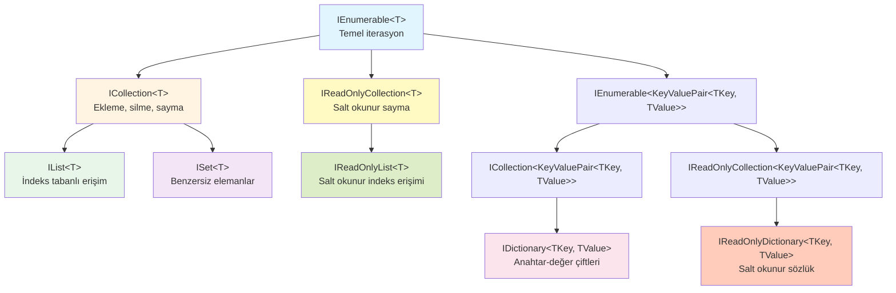
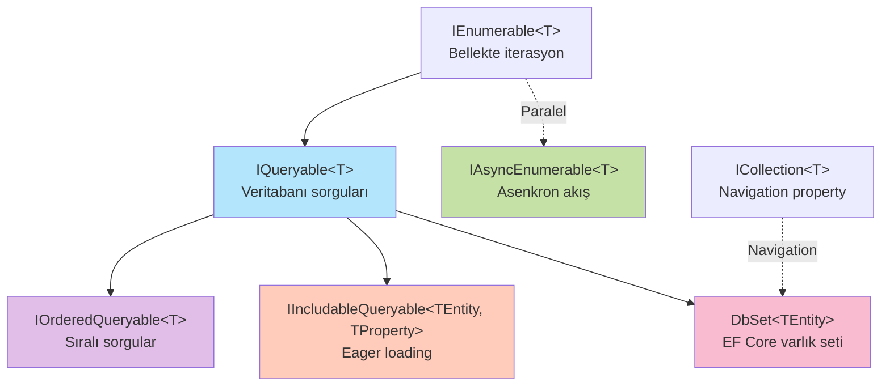
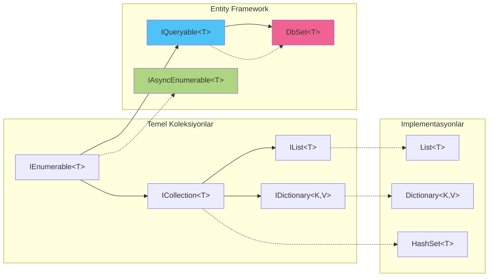

# C# Jenerik Koleksiyon Arabirimleri: Kapsamlı Rehber

C# programlama dilinde koleksiyonlar, verileri organize etmek ve yönetmek için vazgeçilmez yapılardır. .NET Framework'ün sunduğu jenerik koleksiyon arabirimleri, tip güvenliği sağlayarak ve performansı artırarak modern yazılım geliştirme süreçlerinin temel taşlarını oluşturur. Bu makalede, C# jenerik koleksiyon arabirimlerini detaylı bir şekilde inceleyecek ve aralarındaki hiyerarşik ilişkileri görselleştireceğiz.

## Jenerik Koleksiyonların Önemi

Jenerik koleksiyonlar, C# 2.0 ile birlikte dile eklenen ve tip güvenliği sağlayan yapılardır. Jenerik olmayan koleksiyonların (`ArrayList`, `Hashtable` gibi) aksine, jenerik koleksiyonlar derleme zamanında tip kontrolü yapar ve boxing/unboxing maliyetlerini ortadan kaldırır.

## Temel Koleksiyon Arabirimleri

### 1. IEnumerable<T>

`IEnumerable<T>`, tüm jenerik koleksiyonların temelini oluşturan en basit arabirimdir. Bu arabirim, koleksiyon üzerinde iterasyon yapılmasını sağlar.

**Temel Özellikler:**
- `GetEnumerator()` metodunu içerir
- LINQ sorgularının temelini oluşturur
- Read-only erişim sağlar
- Lazy evaluation destekler

**Kullanım Senaryoları:**
- LINQ sorguları yazmak
- `foreach` döngüsü kullanmak
- Veri akışlarını temsil etmek

```csharp
IEnumerable<int> numbers = new List<int> { 1, 2, 3, 4, 5 };
foreach (var num in numbers)
{
    Console.WriteLine(num);
}
```

### 2. ICollection<T>

`ICollection<T>`, `IEnumerable<T>`'den türetilen ve koleksiyona ekleme, çıkarma ve sayma işlemleri ekleyen bir arabirimdir.

**Temel Özellikler:**
- `Count` özelliği ile eleman sayısını döndürür
- `Add()`, `Remove()`, `Clear()` metodları ile koleksiyonu değiştirir
- `Contains()` ile eleman varlığını kontrol eder
- `IsReadOnly` özelliği ile salt okunurluk durumunu bildirir

**Kullanım Senaryoları:**
- Dinamik koleksiyonlar oluşturmak
- Temel CRUD operasyonları gerçekleştirmek

```csharp
ICollection<string> cities = new List<string>();
cities.Add("İstanbul");
cities.Add("Ankara");
Console.WriteLine($"Şehir sayısı: {cities.Count}");
```

### 3. IList<T>

`IList<T>`, `ICollection<T>`'den türetilen ve indeks tabanlı erişim sağlayan bir arabirimdir. Liste yapılarının temel özelliklerini tanımlar.

**Temel Özellikler:**
- İndeks operatörü `[]` ile elemanlara erişim
- `Insert()` ile belirli konumlara ekleme
- `RemoveAt()` ile indekse göre silme
- `IndexOf()` ile eleman pozisyonunu bulma
- Sıralı koleksiyonlar için idealdir

**Kullanım Senaryoları:**
- Sıralı veri listeleri
- Pozisyon bazlı işlemler
- Dinamik diziler

```csharp
IList<double> prices = new List<double> { 19.99, 29.99, 39.99 };
prices[1] = 24.99; // İndeks ile erişim
prices.Insert(0, 9.99); // Başa ekleme
```

### 4. IDictionary<TKey, TValue>

`IDictionary<TKey, TValue>`, anahtar-değer çiftlerini saklayan koleksiyonlar için temel arabirimdir. `ICollection<KeyValuePair<TKey, TValue>>` arabiriminden türetilir.

**Temel Özellikler:**
- Anahtar tabanlı hızlı erişim (O(1) ortalama)
- `Keys` ve `Values` koleksiyonları
- `Add()`, `Remove()`, `ContainsKey()` metodları
- İndeks operatörü ile anahtar-değer erişimi
- Benzersiz anahtarlar zorunluluğu

**Kullanım Senaryoları:**
- Önbellek (cache) sistemleri
- Yapılandırma ayarları
- Veri eşleştirmeleri

```csharp
IDictionary<string, int> ages = new Dictionary<string, int>
{
    ["Ahmet"] = 25,
    ["Ayşe"] = 30
};
ages.Add("Mehmet", 28);
if (ages.ContainsKey("Ahmet"))
{
    Console.WriteLine($"Ahmet'in yaşı: {ages["Ahmet"]}");
}
```

### 5. ISet<T>

`ISet<T>`, benzersiz elemanlar içeren ve küme işlemlerini destekleyen bir arabirimdir. `ICollection<T>`'den türetilir.

**Temel Özellikler:**
- Otomatik benzersizlik garantisi
- `UnionWith()`, `IntersectWith()`, `ExceptWith()` gibi küme işlemleri
- `IsSubsetOf()`, `IsSupersetOf()` gibi küme karşılaştırmaları
- `Overlaps()` ile kesişim kontrolü
- Hızlı arama performansı

**Kullanım Senaryoları:**
- Tekil değerlerin saklanması
- Küme teorisi operasyonları
- Duplikasyon önleme

```csharp
ISet<string> tags = new HashSet<string> { "csharp", "dotnet", "programming" };
tags.Add("csharp"); // Eklenmez, çünkü zaten var

ISet<string> moreTags = new HashSet<string> { "programming", "coding" };
tags.UnionWith(moreTags); // Birleşim işlemi
```

### 6. IReadOnlyCollection<T>

`IReadOnlyCollection<T>`, salt okunur koleksiyonlar için bir arabirimdir. `IEnumerable<T>`'den türetilir ve sadece okuma işlemlerine izin verir.

**Temel Özellikler:**
- `Count` özelliği (salt okunur)
- Değiştirme metodları içermez
- Immutability teşvik eder
- Veri koruma sağlar

**Kullanım Senaryoları:**
- API dönüş tipleri
- Değişmez koleksiyonları paylaşma
- Encapsulation

```csharp
IReadOnlyCollection<int> readOnlyNumbers = new List<int> { 1, 2, 3 }.AsReadOnly();
Console.WriteLine($"Eleman sayısı: {readOnlyNumbers.Count}");
// readOnlyNumbers.Add(4); // Derleme hatası
```

### 7. IReadOnlyList<T>

`IReadOnlyList<T>`, `IReadOnlyCollection<T>`'den türetilen ve indeks tabanlı salt okunur erişim sağlayan bir arabirimdir.

**Temel Özellikler:**
- İndeks operatörü ile salt okunur erişim
- Liste sırası korunur
- Değiştirme metodları içermez

**Kullanım Senaryoları:**
- Dönüş değerleri olarak güvenli liste paylaşımı
- Konfigürasyon listeleri

```csharp
IReadOnlyList<string> months = new List<string> 
{ 
    "Ocak", "Şubat", "Mart" 
}.AsReadOnly();
Console.WriteLine(months[0]); // "Ocak"
```

### 8. IReadOnlyDictionary<TKey, TValue>

`IReadOnlyDictionary<TKey, TValue>`, `IReadOnlyCollection<KeyValuePair<TKey, TValue>>` arabiriminden türetilen ve salt okunur anahtar-değer koleksiyonlarını temsil eder.

**Temel Özellikler:**
- Anahtar ile salt okunur erişim
- `Keys` ve `Values` salt okunur koleksiyonları
- `ContainsKey()` ve `TryGetValue()` metodları
- Değiştirme işlemleri yoktur

**Kullanım Senaryoları:**
- Yapılandırma sözlükleri
- Sabit veri eşleştirmeleri

```csharp
IReadOnlyDictionary<string, string> constants = new Dictionary<string, string>
{
    ["Pi"] = "3.14159",
    ["E"] = "2.71828"
}.AsReadOnly();
```

## Entity Framework Core Koleksiyon Arabirimleri

Entity Framework Core, veritabanı işlemleri için özel olarak tasarlanmış koleksiyon arabirimleri sunar. Bu arabirimler, ORM (Object-Relational Mapping) işlemlerini optimize eder ve veritabanı bağlamında koleksiyon yönetimini kolaylaştırır.

### 9. IQueryable<T>

`IQueryable<T>`, `IEnumerable<T>`'den türetilen ve LINQ sorgularını expression tree'lere dönüştürerek veritabanı tarafında çalıştırılmasını sağlayan güçlü bir arabirimdir.

**Temel Özellikler:**
- Expression tree tabanlı sorgu oluşturma
- Deferred execution (ertelenmiş çalıştırma)
- Veritabanı tarafında sorgu işleme
- `Provider` ve `Expression` özellikleri
- LINQ to SQL desteği

**IEnumerable<T> ile Farkları:**

| Özellik | IQueryable<T> | IEnumerable<T> |
|---------|---------------|----------------|
| Sorgu Yürütme | Veritabanında | Bellekte |
| Expression | Expression Tree | Delegate |
| Performans | Büyük veri için optimal | Küçük veri için yeterli |
| Filtreleme | SQL WHERE | LINQ Where (bellekte) |

**Kullanım Senaryoları:**
- Entity Framework Core sorguları
- Büyük veri setleri üzerinde filtreleme
- Dinamik sorgu oluşturma
- Sayfalama (pagination)

```csharp
// Veritabanı tarafında çalışır
IQueryable<Product> expensiveProducts = dbContext.Products
    .Where(p => p.Price > 1000)
    .OrderBy(p => p.Name)
    .Take(10); // SQL: SELECT TOP 10 ... WHERE Price > 1000 ORDER BY Name

// Bu noktada sorgu henüz çalışmadı
foreach (var product in expensiveProducts) // Şimdi çalıştı
{
    Console.WriteLine(product.Name);
}
```

**En İyi Uygulamalar:**
```csharp
// İyi - Veritabanında filtreleme
var query = dbContext.Orders
    .Where(o => o.TotalAmount > 500)
    .Select(o => new { o.Id, o.CustomerName });

// Kötü - Tüm veriyi belleğe çeker sonra filtreler
var query = dbContext.Orders
    .AsEnumerable() // IEnumerable'a dönüştü
    .Where(o => o.TotalAmount > 500); // Artık bellekte çalışıyor
```

### 10. IAsyncEnumerable<T>

`IAsyncEnumerable<T>`, C# 8.0 ile gelen ve asenkron veri akışlarını temsil eden bir arabirimdir. Entity Framework Core'da veritabanı sorgularının asenkron olarak işlenmesini sağlar.

**Temel Özellikler:**
- Asenkron iterasyon desteği
- `await foreach` ile kullanım
- Bellek verimliliği
- Streaming data desteği
- `GetAsyncEnumerator()` metodu

**Kullanım Senaryoları:**
- Büyük veri setlerinin asenkron işlenmesi
- Streaming senaryoları
- UI thread'i bloke etmeden veri işleme
- Entity Framework Core sorguları

```csharp
// Entity Framework Core ile kullanım
await foreach (var customer in dbContext.Customers.AsAsyncEnumerable())
{
    await ProcessCustomerAsync(customer);
    // Her customer geldiğinde işlenir, tümü beklemez
}

// Sayfalama ile birlikte
public async IAsyncEnumerable<Order> GetOrdersAsync(
    [EnumeratorCancellation] CancellationToken cancellationToken = default)
{
    await foreach (var order in dbContext.Orders
        .AsAsyncEnumerable()
        .WithCancellation(cancellationToken))
    {
        yield return order;
    }
}
```

**IEnumerable<T> ve IQueryable<T> ile Karşılaştırma:**

```csharp
// Senkron - UI bloke olur
var orders = dbContext.Orders.ToList();
foreach (var order in orders)
{
    ProcessOrder(order);
}

// Asenkron ama hepsini bekler
var orders = await dbContext.Orders.ToListAsync();
foreach (var order in orders)
{
    await ProcessOrderAsync(order);
}

// Asenkron streaming - Geldikçe işler
await foreach (var order in dbContext.Orders.AsAsyncEnumerable())
{
    await ProcessOrderAsync(order);
}
```

### 11. IIncludableQueryable<TEntity, TProperty>

`IIncludableQueryable<TEntity, TProperty>`, Entity Framework Core'da ilişkili varlıkların yüklenmesini (eager loading) yönetmek için kullanılan özel bir arabirimdir.

**Temel Özellikler:**
- Fluent API ile zincirleme `Include` ve `ThenInclude` çağrıları
- Tip güvenli ilişki yükleme
- Navigation property'lerin eager loading'i
- Query optimization

**Kullanım Senaryoları:**
- N+1 sorgu problemini çözme
- İlişkili varlıkların önceden yüklenmesi
- Karmaşık nesne grafiklerini oluşturma

```csharp
// ThenInclude ile zincirleme
var orders = await dbContext.Orders
    .Include(o => o.Customer)
        .ThenInclude(c => c.Address)
    .Include(o => o.OrderItems)
        .ThenInclude(oi => oi.Product)
    .ToListAsync();

// IIncludableQueryable kullanımı
IIncludableQueryable<Order, Address> query = dbContext.Orders
    .Include(o => o.Customer)
        .ThenInclude(c => c.Address);
```

### 12. IQueryable Collection Navigation

Entity Framework Core'da koleksiyon navigation property'leri için özel arabirimler ve extension metodları bulunur.

**Temel Özellikler:**
- `ICollection<T>` implementasyonu
- Lazy loading desteği
- Change tracking
- Proxy oluşturma

**Kullanım Örneği:**

```csharp
public class Customer
{
    public int Id { get; set; }
    public string Name { get; set; }
    
    // Navigation property - ICollection<T>
    public ICollection<Order> Orders { get; set; } = new List<Order>();
}

// Kullanım
var customer = await dbContext.Customers
    .Include(c => c.Orders)
    .FirstOrDefaultAsync(c => c.Id == 1);

customer.Orders.Add(new Order { /* ... */ });
await dbContext.SaveChangesAsync();
```

## Arabirimler Arası Hiyerarşi ve İlişkiler

### Temel Koleksiyon Arabirimleri Hiyerarşisi



### Entity Framework Core Arabirimleri ve İlişkileri



### Tam Ekosistem Görünümü



## Yaygın Implementasyonlar

Her arabirimin popüler implementasyonları şunlardır:

### Temel Koleksiyonlar

| Arabirim | Popüler Implementasyonlar |
|----------|---------------------------|
| `IList<T>` | `List<T>`, `Collection<T>`, `ObservableCollection<T>` |
| `IDictionary<TKey, TValue>` | `Dictionary<TKey, TValue>`, `SortedDictionary<TKey, TValue>`, `ConcurrentDictionary<TKey, TValue>` |
| `ISet<T>` | `HashSet<T>`, `SortedSet<T>` |
| `ICollection<T>` | `List<T>`, `HashSet<T>`, `LinkedList<T>`, `Queue<T>`, `Stack<T>` |

### Entity Framework Core Implementasyonlar

| Arabirim | Entity Framework Implementasyonlar |
|----------|-------------------------------------|
| `IQueryable<T>` | `DbSet<T>`, `EntityQueryable<T>` |
| `IAsyncEnumerable<T>` | `EntityAsyncEnumerable<T>` |
| `IIncludableQueryable<T, P>` | `IncludableQueryable<T, P>` |

## Entity Framework Core ile Koleksiyon Kullanımı

### Sorgu Performansı Optimizasyonu

```csharp
// Kötü: N+1 problemi
var customers = await dbContext.Customers.ToListAsync();
foreach (var customer in customers)
{
    // Her döngüde ayrı sorgu
    var orders = await dbContext.Orders
        .Where(o => o.CustomerId == customer.Id)
        .ToListAsync();
}

// İyi: Eager loading
var customers = await dbContext.Customers
    .Include(c => c.Orders)
    .ToListAsync();

// Daha İyi: Projection ile sadece gerekli alanlar
var customerSummaries = await dbContext.Customers
    .Select(c => new 
    {
        c.Name,
        OrderCount = c.Orders.Count,
        TotalAmount = c.Orders.Sum(o => o.TotalAmount)
    })
    .ToListAsync();
```

### Asenkron İşlemler

```csharp
// IAsyncEnumerable ile streaming
public async IAsyncEnumerable<OrderDto> GetOrdersStreamAsync(
    [EnumeratorCancellation] CancellationToken ct = default)
{
    await foreach (var order in dbContext.Orders
        .AsAsyncEnumerable()
        .WithCancellation(ct))
    {
        yield return new OrderDto
        {
            Id = order.Id,
            CustomerName = order.Customer.Name,
            Total = order.TotalAmount
        };
    }
}

// Kullanım
await foreach (var order in GetOrdersStreamAsync())
{
    await ProcessOrderAsync(order);
    // Her order geldiğinde işlenir
}
```

### Dinamik Sorgular

```csharp
public IQueryable<Product> GetFilteredProducts(
    string searchTerm, 
    decimal? minPrice, 
    decimal? maxPrice)
{
    IQueryable<Product> query = dbContext.Products;
    
    if (!string.IsNullOrEmpty(searchTerm))
    {
        query = query.Where(p => p.Name.Contains(searchTerm));
    }
    
    if (minPrice.HasValue)
    {
        query = query.Where(p => p.Price >= minPrice.Value);
    }
    
    if (maxPrice.HasValue)
    {
        query = query.Where(p => p.Price <= maxPrice.Value);
    }
    
    return query.OrderBy(p => p.Name);
}

// Kullanım - Sorgu henüz çalışmadı
var query = GetFilteredProducts("laptop", 500, 2000);
var products = await query.ToListAsync(); // Şimdi çalıştı
```

## Performans Karşılaştırması

Farklı operasyonların farklı koleksiyon tiplerindeki zaman karmaşıklıkları:

### Temel Koleksiyonlar

| Operasyon | List<T> | Dictionary<TKey, TValue> | HashSet<T> |
|-----------|---------|--------------------------|------------|
| Ekleme (sona) | O(1)* | O(1)* | O(1)* |
| Ekleme (başa/ortaya) | O(n) | - | - |
| Arama | O(n) | O(1)* | O(1)* |
| Silme | O(n) | O(1)* | O(1)* |
| İndeks erişimi | O(1) | O(1) | - |

*Ortalama durum, en kötü durum O(n) olabilir

### Entity Framework Core Performans İpuçları

| Yaklaşım | Performans | Kullanım Senaryosu |
|----------|-----------|---------------------|
| `ToList()` | Tüm veriyi belleğe yükler | Küçük-orta veri setleri |
| `AsAsyncEnumerable()` | Streaming, düşük bellek | Büyük veri setleri |
| `AsNoTracking()` | %40-50 daha hızlı | Salt okunur sorgular |
| `Select()` (Projection) | Sadece gerekli alanlar | Performans kritik sorgular |
| `Include()` | Eager loading, tek sorgu | İlişkili veri gerekli |
| `FirstOrDefault()` | Sadece ilk kayıt | Tek kayıt sorguları |

### IQueryable vs IEnumerable Performans Karşılaştırması

```csharp
// IQueryable - Veritabanında filtreleme
// SQL: SELECT * FROM Products WHERE Price > 1000
var expensiveProducts = dbContext.Products
    .Where(p => p.Price > 1000) // Veritabanında
    .ToList(); // 100 kayıt geldi

// IEnumerable - Bellekte filtreleme
// SQL: SELECT * FROM Products
var allProducts = dbContext.Products.AsEnumerable(); // 10,000 kayıt geldi
var expensiveProducts = allProducts
    .Where(p => p.Price > 1000) // Bellekte filtrelendi
    .ToList(); // 100 kayıt kaldı
```

## En İyi Uygulamalar

### 1. Doğru Arabirimi Seçin
Metodlarınızın parametrelerinde ve dönüş tiplerinde mümkün olan en genel arabirimi kullanın. Bu, esneklik ve test edilebilirlik sağlar.

```csharp
// İyi
public void ProcessItems(IEnumerable<string> items) { }

// Kötü (gereksiz kısıtlama)
public void ProcessItems(List<string> items) { }
```

### 2. Salt Okunur Arabirimler Kullanın
Dış dünyaya koleksiyon sunarken değiştirme gerekli değilse, salt okunur arabirimler kullanın.

```csharp
public IReadOnlyList<Product> GetProducts()
{
    return _products.AsReadOnly();
}
```

### 3. LINQ ile Verimli Kullanım
`IEnumerable<T>` ile LINQ sorgularını kullanırken lazy evaluation'dan yararlanın.

```csharp
var expensiveProducts = products
    .Where(p => p.Price > 1000)
    .OrderByDescending(p => p.Price)
    .Take(10);
```

### 4. Kapasite Belirtme
Eleman sayısını önceden biliyorsanız, performans için başlangıç kapasitesini belirtin.

```csharp
var list = new List<int>(1000); // 1000 elemanlık kapasite
var dict = new Dictionary<string, int>(500); // 500 elemanlık kapasite
```

### 5. Entity Framework Core İçin En İyi Uygulamalar

#### AsNoTracking Kullanımı
```csharp
// Salt okunur sorgular için tracking'i kapatın
var products = await dbContext.Products
    .AsNoTracking()
    .ToListAsync();
```

#### Projection ile Veri Miktarını Azaltın
```csharp
// Kötü: Tüm kolonlar gelir
var customers = await dbContext.Customers.ToListAsync();

// İyi: Sadece gerekli alanlar
var customers = await dbContext.Customers
    .Select(c => new { c.Id, c.Name, c.Email })
    .ToListAsync();
```

#### IQueryable'ı Metodlar Arası Taşıyın
```csharp
public IQueryable<Order> GetActiveOrders()
{
    return dbContext.Orders
        .Where(o => o.Status == OrderStatus.Active);
}

public async Task<List<Order>> GetRecentActiveOrders(int count)
{
    return await GetActiveOrders()
        .OrderByDescending(o => o.CreatedDate)
        .Take(count)
        .ToListAsync();
}
```

#### Büyük Veri Setleri İçin Sayfalama
```csharp
public async Task<PagedResult<Product>> GetProductsPagedAsync(
    int pageNumber, 
    int pageSize)
{
    var query = dbContext.Products.AsQueryable();
    
    var totalCount = await query.CountAsync();
    
    var items = await query
        .Skip((pageNumber - 1) * pageSize)
        .Take(pageSize)
        .ToListAsync();
    
    return new PagedResult<Product>
    {
        Items = items,
        TotalCount = totalCount,
        PageNumber = pageNumber,
        PageSize = pageSize
    };
}
```

#### Asenkron Streaming ile Bellek Optimizasyonu
```csharp
// Kötü: Tüm veri belleğe yüklenir
var orders = await dbContext.Orders.ToListAsync();
foreach (var order in orders)
{
    await ProcessOrderAsync(order);
}

// İyi: Streaming ile bellek dostu
await foreach (var order in dbContext.Orders.AsAsyncEnumerable())
{
    await ProcessOrderAsync(order);
}
```

#### Explicit Loading ve Lazy Loading
```csharp
// Explicit Loading - İhtiyaç duyulduğunda yükle
var customer = await dbContext.Customers
    .FirstOrDefaultAsync(c => c.Id == 1);

if (needOrders)
{
    await dbContext.Entry(customer)
        .Collection(c => c.Orders)
        .LoadAsync();
}

// Eager Loading - Önceden yükle
var customer = await dbContext.Customers
    .Include(c => c.Orders)
    .FirstOrDefaultAsync(c => c.Id == 1);
```

### 6. Thread Safety Konuları

```csharp
// Thread-safe koleksiyonlar
using System.Collections.Concurrent;

// Çoklu thread'ler için güvenli
var concurrentDict = new ConcurrentDictionary<int, string>();
var concurrentBag = new ConcurrentBag<int>();

// Entity Framework Core - DbContext thread-safe DEĞİLDİR
// Her thread için ayrı instance kullanın
public class OrderService
{
    private readonly IDbContextFactory<AppDbContext> _contextFactory;
    
    public async Task ProcessOrdersAsync()
    {
        using var dbContext = _contextFactory.CreateDbContext();
        // İşlemler...
    }
}
```

## Sonuç

C# jenerik koleksiyon arabirimleri, modern yazılım geliştirmenin temel yapı taşlarıdır. Her arabirimin kendine özgü kullanım senaryoları ve performans karakteristikleri vardır. Doğru arabirimi seçmek, kodunuzun okunabilirliğini, sürdürülebilirliğini ve performansını doğrudan etkiler.

### Temel Koleksiyonlar İçin Öneriler

Arabirimler arası hiyerarşiyi anlamak, daha esnek ve genişletilebilir kod yazmanızı sağlar. `IEnumerable<T>` gibi temel arabirimlerden başlayarak, ihtiyacınıza göre daha spesifik arabirimlere geçiş yapabilirsiniz. Salt okunur arabirimler ise veri bütünlüğünü korumak ve API tasarımında güvenlik sağlamak için vazgeçilmezdir.

**Hızlı Seçim Kılavuzu:**
- **Sadece iterasyon** → `IEnumerable<T>`
- **Ekleme/silme gerekli** → `ICollection<T>`
- **İndeks erişimi** → `IList<T>`
- **Anahtar-değer çiftleri** → `IDictionary<TKey, TValue>`
- **Benzersiz elemanlar** → `ISet<T>`
- **Salt okunur** → `IReadOnlyCollection<T>`, `IReadOnlyList<T>`, `IReadOnlyDictionary<TKey, TValue>`

### Entity Framework Core İçin Öneriler

Entity Framework Core ile çalışırken, sorgu performansı ve bellek yönetimi kritik öneme sahiptir. `IQueryable<T>` arabirimini kullanarak veritabanı tarafında filtreleme yapın, `IAsyncEnumerable<T>` ile büyük veri setlerini streaming şeklinde işleyin ve `AsNoTracking()` ile salt okunur sorguları optimize edin.

**EF Core Seçim Kılavuzu:**
- **Veritabanı sorguları** → `IQueryable<T>`
- **Büyük veri setleri** → `IAsyncEnumerable<T>`
- **İlişkili veriler** → `IIncludableQueryable<T, P>`
- **Navigation property'ler** → `ICollection<T>`
- **Salt okunur sorgular** → `AsNoTracking()` + `IQueryable<T>`

### Performans ve Optimizasyon

Performans açısından, her senaryoda en uygun koleksiyon tipini ve arabirimini seçmek önemlidir:

1. **Küçük veri setleri (<1000 kayıt)**: `ToList()` veya `ToArray()` kullanabilirsiniz
2. **Büyük veri setleri**: `AsAsyncEnumerable()` ile streaming yapın
3. **Salt okunur işlemler**: `AsNoTracking()` kullanın
4. **İlişkili veriler**: Eager loading ile N+1 problemini önleyin
5. **Projection**: Sadece gerekli alanları çekin

### Son Tavsiyeler

Bu bilgilerle donanmış olarak, C# koleksiyonlarını daha etkili kullanabilir ve projenizin gereksinimlerine en uygun veri yapılarını seçebilirsiniz. Hem temel koleksiyonları hem de Entity Framework Core'un sunduğu özel arabirimleri doğru senaryolarda kullanarak, performanslı, okunabilir ve sürdürülebilir kod yazabilirsiniz.

Unutmayın ki, en iyi performans sadece doğru arabirim seçimiyle değil, aynı zamanda veri modelinizin tasarımı, indeksleme stratejiniz ve sorgu optimizasyonlarınızla birlikte gelir. Bu arabirimler, bu hedeflere ulaşmak için size sunulan güçlü araçlardır.

---

**Kaynaklar:**
- [Microsoft Docs - Collections and Data Structures](https://docs.microsoft.com/en-us/dotnet/standard/collections/)
- [Entity Framework Core Documentation](https://docs.microsoft.com/en-us/ef/core/)
- [C# Language Specification](https://docs.microsoft.com/en-us/dotnet/csharp/language-reference/)