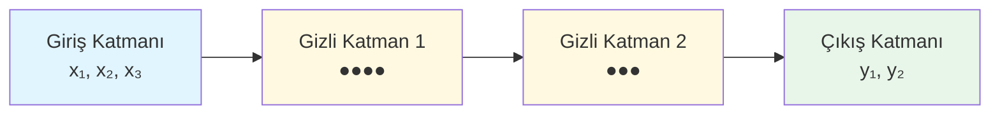
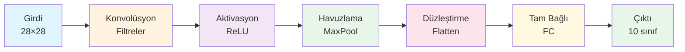
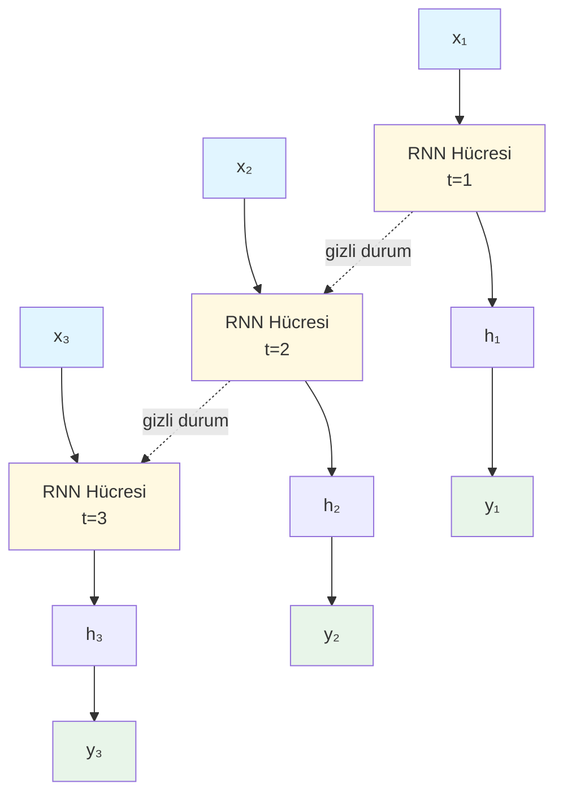
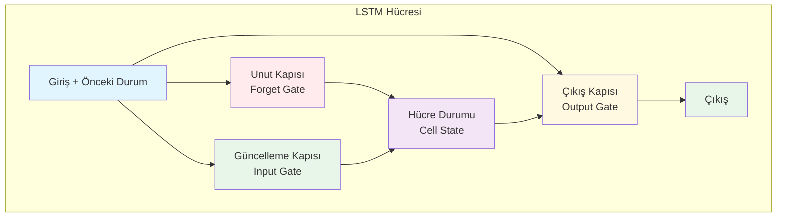

# Yapay Sinir Ağı Türleri - Detaylı Eğitim Dokümanı

## 📚 İçindekiler

1. [Giriş](#giriş)
2. [Feedforward Neural Networks (İleri Beslemeli Sinir Ağları)](#1-feedforward-neural-networks-ileri-beslemeli-sinir-ağları)
3. [Convolutional Neural Networks (Evrişimsel Sinir Ağları)](#2-convolutional-neural-networks-evrişimsel-sinir-ağları)
4. [Recurrent Neural Networks (Yinelemeli Sinir Ağları)](#3-recurrent-neural-networks-yinelemeli-sinir-ağları)
5. [Long Short-Term Memory Networks (LSTM)](#4-long-short-term-memory-networks-lstm)
6. [Generative Adversarial Networks (Üretken Çekişmeli Ağlar)](#5-generative-adversarial-networks-üretken-çekişmeli-ağlar)
7. [Autoencoders (Otokodlayıcılar)](#6-autoencoders-otokodlayıcılar)
8. [Transformer Ağları](#7-transformer-ağları)
9. [Karşılaştırma Tablosu](#karşılaştırma-tablosu)

---

## Giriş

Yapay sinir ağları, insan beynindeki nöronların çalışma prensibinden esinlenerek geliştirilmiş makine öğrenmesi modellerindir. Her bir yapay sinir ağı türü, farklı problem türlerini çözmek için özelleştirilmiş mimari ve öğrenme mekanizmalarına sahiptir.

---

## 1. Feedforward Neural Networks (İleri Beslemeli Sinir Ağları)

### 🔍 Nedir?

En temel yapay sinir ağı türüdür. Bilgi, giriş katmanından çıkış katmanına doğru tek yönlü akar ve geriye dönüş yoktur. Çok Katmanlı Algılayıcılar (Multilayer Perceptrons - MLP) bu kategorinin en yaygın örneğidir.

### 📊 Mimari Yapı



### 💡 Kullanım Alanları

- Sınıflandırma problemleri (spam tespiti, hastalık teşhisi)
- Regresyon problemleri (fiyat tahmini, risk değerlendirmesi)
- Basit örüntü tanıma görevleri
- Finansal tahminleme
- Kalite kontrol sistemleri

### ✅ Avantajları

- Basit ve anlaşılır yapı
- Hızlı eğitim süresi
- Evrensel yaklaşıklık teoremi sayesinde herhangi bir fonksiyonu öğrenebilme
- Az veri ile çalışabilme
- Düşük hesaplama maliyeti

### ❌ Dezavantajları

- Karmaşık yapısal verilerde (görüntü, ses) yetersiz kalma
- Uzamsal ilişkileri yakalayamama
- Zamansal bağımlılıkları modelleyememe
- Çok fazla parametre gerektirebilme
- Aşırı öğrenmeye (overfitting) eğilimli

### 📌 Ek Bilgiler

- İlk yapay sinir ağı modeli olan Perceptron (1958) bu kategoridedir
- Backpropagation algoritması ile eğitilir
- Aktivasyon fonksiyonları: ReLU, Sigmoid, Tanh

---

## 2. Convolutional Neural Networks (Evrişimsel Sinir Ağları)

### 🔍 Nedir?

Görsel verileri işlemek için özel olarak tasarlanmış sinir ağlarıdır. Evrişim (convolution) işlemi ile görüntüdeki yerel özellikleri algılar ve hiyerarşik öğrenme yapar.

### 📊 Mimari Yapı



### 💡 Kullanım Alanları

- Görüntü sınıflandırma (nesne tanıma, yüz tanıma)
- Nesne algılama ve segmentasyon
- Medikal görüntü analizi (MR, röntgen, CT)
- Otonom araç sistemleri
- Video analizi
- Sanat ve stil transferi
- Optik karakter tanıma (OCR)

### ✅ Avantajları

- Uzamsal ilişkileri çok iyi yakalama
- Parametre paylaşımı ile düşük parametre sayısı
- Translasyon değişmezliği (nesne görüntünün neresinde olursa olsun tanıma)
- Otomatik özellik çıkarımı
- Hiyerarşik öğrenme (basit → karmaşık özellikler)

### ❌ Dezavantajları

- Yüksek hesaplama gücü gereksinimi (GPU zorunlu)
- Büyük veri seti ihtiyacı
- Eğitim süresi uzun
- Rotasyon ve ölçeklemeye karşı hassasiyet
- Hiperparametre ayarlaması karmaşık

### 📌 Ek Bilgiler

- Popüler mimariler: LeNet, AlexNet, VGG, ResNet, Inception, EfficientNet
- Transfer öğrenme ile az veri ile başarılı sonuçlar
- Konvolüsyon katmanları yerel bağlantılıdır
- Pooling katmanları boyut azaltma sağlar

---

## 3. Recurrent Neural Networks (Yinelemeli Sinir Ağları)

### 🔍 Nedir?

Zamansal veya sıralı veriyi işlemek için tasarlanmış ağlardır. Döngüsel bağlantılar sayesinde önceki bilgiyi hafızada tutar ve mevcut girdiyle birleştirir.

### 📊 Mimari Yapı



### 💡 Kullanım Alanları

- Doğal dil işleme (metin üretimi, çeviri)
- Konuşma tanıma
- Müzik üretimi
- Zaman serisi tahmini (hisse senedi, hava durumu)
- Video analizi
- El yazısı tanıma
- Duygu analizi

### ✅ Avantajları

- Değişken uzunluktaki dizileri işleyebilme
- Zamansal bağımlılıkları yakalama
- Parametre paylaşımı
- Sıralı karar verme süreçlerinde etkili
- Gizli durum ile bellek mekanizması

### ❌ Dezavantajları

- Vanishing/Exploding Gradient problemi
- Uzun vadeli bağımlılıkları öğrenememe
- Paralel işleme zorluğu (eğitim yavaş)
- Eğitim kararsızlığı
- Hesaplama maliyeti yüksek

### 📌 Ek Bilgiler

- Backpropagation Through Time (BPTT) ile eğitilir
- Bidirectional RNN: İleri ve geri yönde bilgi akışı
- Gradient clipping ile gradient patlaması önlenir
- Modern uygulamalarda LSTM ve GRU tercih edilir

---

## 4. Long Short-Term Memory Networks (LSTM)

### 🔍 Nedir?

RNN'lerin geliştirilmiş halidir. Özel kapı mekanizmaları (forget, input, output gates) ile uzun vadeli bağımlılıkları öğrenebilir ve vanishing gradient problemini çözer.

### 📊 Mimari Yapı



### 💡 Kullanım Alanları

- Makine çevirisi
- Metin üretimi ve tamamlama
- Konuşma sentezi
- Video açıklama oluşturma
- Müzik kompozisyonu
- Anomali tespiti (zaman serilerinde)
- Protein yapısı tahmini

### ✅ Avantajları

- Uzun vadeli bağımlılıkları öğrenebilme
- Vanishing gradient problemine çözüm
- Seçici hafıza mekanizması
- RNN'den daha kararlı eğitim
- Karmaşık zamansal örüntüleri yakalama

### ❌ Dezavantajları

- Yüksek hesaplama maliyeti
- Çok fazla parametre (RNN'in 4 katı)
- Eğitim süresi uzun
- Bellek tüketimi fazla
- Overfitting riski yüksek

### 📌 Ek Bilgiler

- 1997'de Hochreiter ve Schmidhuber tarafından geliştirildi
- GRU (Gated Recurrent Unit): LSTM'in basitleştirilmiş versiyonu
- Bidirectional LSTM: Her iki yönde de bilgi işleme
- Attention mekanizması ile birlikte kullanılır

---

## 5. Generative Adversarial Networks (Üretken Çekişmeli Ağlar)

### 🔍 Nedir?

İki sinir ağının (Üretici ve Ayırt Edici) birbirine karşı yarıştığı bir modeldir. Üretici yeni veri üretir, Ayırt Edici ise gerçek ve sahte veriyi ayırt etmeye çalışır.

### 📊 Mimari Yapı

```python
Rastgele Gürültü → [ÜRETİCİ] → Sahte Veri
                                    ↓
Gerçek Veri ────────────────→ [AYIRT EDİCİ] → Gerçek/Sahte?
                                    ↑
                              Kayıp Geri Besleme
```

### 💡 Kullanım Alanları

- Görüntü üretimi (yüz, sanat eseri, manzara)
- Görüntü iyileştirme ve süper çözünürlük
- Stil transferi
- Veri artırma (data augmentation)
- Deepfake teknolojisi
- Metin-görüntü dönüşümü
- İlaç molekülü tasarımı
- Video üretimi

### ✅ Avantajları

- Gerçekçi veri üretme kapasitesi
- Örtük olasılık dağılımını öğrenme
- Keskin ve detaylı çıktılar
- Denetimsiz öğrenme yapabilme
- Yaratıcı uygulamalar için ideal

### ❌ Dezavantajları

- Eğitim kararsızlığı (mode collapse)
- Dengeleme problemi (Üretici vs Ayırt Edici)
- Yakınsama garantisi yok
- Hiperparametre hassasiyeti çok yüksek
- Değerlendirme metrikleri subjektif

### 📌 Ek Bilgiler

- 2014'te Ian Goodfellow tarafından geliştirildi
- Popüler varyantlar: DCGAN, StyleGAN, CycleGAN, Pix2Pix
- Wasserstein GAN (WGAN): Eğitim kararlılığını artırır
- Progressive GAN: Yüksek çözünürlüklü görüntü üretimi
- Etik sorunlar ve deepfake riskleri

---

## 6. Autoencoders (Otokodlayıcılar)

### 🔍 Nedir?

Veriyi sıkıştırıp (kodlayıp) tekrar orijinal haline getirmeyi (çözmeyi) öğrenen denetimsiz öğrenme modelidir. Boyut azaltma ve özellik öğrenme için kullanılır.

### 📊 Mimari Yapı

```python
Giriş → [ENCODER] → Gizli Temsil (Bottleneck) → [DECODER] → Çıkış
[784]  →  [256]   →      [32]                  →   [256]   → [784]
                    (sıkıştırılmış)
```

### 💡 Kullanım Alanları

- Boyut azaltma ve özellik çıkarımı
- Anomali tespiti
- Görüntü gürültü giderme
- Görüntü sıkıştırma
- Veri tamamlama (eksik veri doldurma)
- Öneri sistemleri
- Yüz tanıma (özellik öğrenme)

### ✅ Avantajları

- Denetimsiz öğrenme (etiket gerektirmez)
- Etkili boyut azaltma
- Özellik öğrenme otomatik
- Gürültüye karşı dayanıklı modeller
- Veri sıkıştırma

### ❌ Dezavantajları

- Üretici modeller kadar gerçekçi değil
- Overfitting riski
- Orijinal veri ile aynı dağılımda çıktı
- Yeni veri üretme kabiliyeti sınırlı
- Hiperparametre seçimi kritik

### 📌 Ek Bilgiler

- Variational Autoencoder (VAE): Olasılıksal yaklaşım, daha iyi üretim
- Denoising Autoencoder: Gürültü giderme için
- Sparse Autoencoder: Seyrek temsil öğrenme
- Convolutional Autoencoder: Görüntüler için
- PCA'ya alternatif, daha güçlü

---

## 7. Transformer Ağları

### 🔍 Nedir?

Self-attention mekanizması kullanan, sıralı veriyi paralel işleyebilen modern mimaridir. RNN ve LSTM'lerin yerini almıştır. "Attention is All You Need" makalesi ile tanıtılmıştır.

### 📊 Mimari Yapı

```python
Giriş → [Positional Encoding] → [Multi-Head Attention] → [Feed Forward]
                                          ↓
                                  [Add & Normalize]
                                          ↓
                                  [Encoder/Decoder]
```

### 💡 Kullanım Alanları

- Doğal dil işleme (GPT, BERT, T5)
- Makine çevirisi
- Metin özetleme
- Soru-cevap sistemleri
- Görüntü işleme (Vision Transformer - ViT)
- Protein yapısı tahmini (AlphaFold)
- Kod üretimi (Codex, Copilot)
- Konuşma tanıma

### ✅ Avantajları

- Paralel işleme (çok hızlı eğitim)
- Uzun vadeli bağımlılıkları mükemmel yakalama
- Self-attention ile ilişkileri modelleme
- Transfer öğrenme için ideal
- Ölçeklenebilir mimari
- Her pozisyona doğrudan erişim

### ❌ Dezavantajları

- Çok yüksek hesaplama maliyeti
- Muazzam veri ihtiyacı
- Bellek tüketimi çok fazla
- Karesel karmaşıklık (sequence uzunluğuna göre)
- Küçük veri setlerinde etkisiz

### 📌 Ek Bilgiler

- 2017'de Google tarafından geliştirildi
- BERT: Encoder tabanlı, anlama odaklı
- GPT: Decoder tabanlı, üretim odaklı
- T5: Encoder-Decoder, evrensel model
- Vision Transformer (ViT): Görüntü sınıflandırma
- Efficient Transformers: Linformer, Performer (bellek optimizasyonu)

---

## Karşılaştırma Tablosu

| Ağ Türü | En İyi Olduğu Alan | Eğitim Hızı | Veri İhtiyacı | Hesaplama Maliyeti |
|----------|-------------------|-------------|---------------|-------------------|
| **Feedforward** | Tablo verisi | ⚡⚡⚡ Hızlı | 📊 Az | 💰 Düşük |
| **CNN** | Görüntü işleme | ⚡⚡ Orta | 📊📊 Orta-Yüksek | 💰💰 Orta |
| **RNN** | Kısa diziler | ⚡ Yavaş | 📊📊 Orta | 💰💰 Orta |
| **LSTM** | Uzun diziler | ⚡ Yavaş | 📊📊📊 Yüksek | 💰💰💰 Yüksek |
| **GAN** | Veri üretimi | ⚡ Çok Yavaş | 📊📊📊 Çok Yüksek | 💰💰💰 Çok Yüksek |
| **Autoencoder** | Boyut azaltma | ⚡⚡ Orta | 📊 Az-Orta | 💰💰 Orta |
| **Transformer** | NLP & Büyük veri | ⚡⚡ Orta-Hızlı | 📊📊📊📊 Çok Yüksek | 💰💰💰💰 Çok Yüksek |

---

## Seçim Rehberi

### Hangi Ağı Ne Zaman Kullanmalı?

**Tablo/Sayısal Veri:**- Feedforward Neural Network (MLP)**Görüntü İşleme:**- CNN (sınıflandırma, algılama, segmentasyon)**Metin/Dil:**
- Transformer (modern uygulamalar)
- LSTM (kaynak kısıtlı durumlar)

**Zaman Serisi:**
- LSTM (uzun bağımlılıklar)
- RNN (basit problemler)
- Transformer (büyük veri)

**Yeni Veri Üretimi:**
- GAN (gerçekçi üretim)
- VAE (kontrollü üretim)

**Boyut Azaltma:**- Autoencoder**Anomali Tespiti:**
- Autoencoder
- LSTM

---

## Sonuç

Yapay sinir ağı türlerinin her biri farklı problem türleri için optimize edilmiştir. Doğru ağ seçimi, probleminizin doğasına, veri tipinize ve kaynaklarınıza bağlıdır. Modern uygulamalarda genellikle hibrit yaklaşımlar (CNN + LSTM, Transformer + CNN gibi) kullanılarak daha güçlü modeller oluşturulmaktadır.

**Gelecek Trendler:**
- Transformer mimarisinin diğer alanlara yayılması
- Daha verimli modeller (model compression, pruning)
- Few-shot ve Zero-shot learning
- Multimodal modeller (metin + görüntü + ses)
- Neuromorphic computing

---

## Teknik Terimler Sözlüğü

### A

**Activation Function (Aktivasyon Fonksiyonu):**Nöronun çıkışını belirleyen matematiksel fonksiyon. ReLU, Sigmoid, Tanh gibi.**Attention Mechanism (Dikkat Mekanizması):**Modelin girdi dizisinin hangi kısımlarına odaklanacağını öğrenmesini sağlayan mekanizma.**Autoencoder:** Veriyi sıkıştırıp tekrar genişleten, denetimsiz öğrenme modeli.

### B

**Backpropagation:**Hata geriye yayılımı. Ağırlıkları güncellemek için hatanın geriye doğru yayılması.**Batch Normalization:**Katmanlar arası veriyi normalize ederek eğitimi hızlandıran teknik.**Batch Size:**Bir eğitim adımında kullanılan örnek sayısı.**Bottleneck:** Autoencoder'da verinin en sıkıştırılmış hali, en düşük boyutlu katman.

### C

**Convolutional Layer (Evrişim Katmanı):**Görüntüde yerel özellikleri tespit eden filtre katmanı.**Cross-Entropy Loss:** Sınıflandırma problemlerinde kullanılan kayıp fonksiyonu.

### D

**Decoder (Çözücü):**Sıkıştırılmış veriyi orijinal formuna döndüren ağ bölümü.**Discriminator (Ayırt Edici):**GAN'da gerçek ve sahte veriyi ayırt etmeye çalışan ağ.**Dropout:** Overfitting'i önlemek için rastgele nöronları devre dışı bırakma tekniği.

### E

**Embedding:**Kategorik veya yüksek boyutlu veriyi düşük boyutlu sürekli vektörlere dönüştürme.**Encoder (Kodlayıcı):**Veriyi düşük boyutlu temsile dönüştüren ağ bölümü.**Epoch:**Tüm eğitim verisinin bir kez ağdan geçirilmesi.**Exploding Gradient:** Gradyanların eğitim sırasında aşırı büyümesi problemi.

### F

**Feature Map:**Konvolüsyon katmanının çıktısı, özellik haritası.**Feedforward:**Bilginin sadece ileri yönde aktığı ağ yapısı.**Filter/Kernel:**CNN'de kullanılan, özellikleri tespit eden küçük matris.**Fine-tuning:** Önceden eğitilmiş modelin yeni görev için ince ayar yapılması.

### G

**GAN (Generative Adversarial Network):**Üretici ve ayırt edici ağın yarıştığı model.**Gate (Kapı):**LSTM'de bilgi akışını kontrol eden mekanizma (forget, input, output gates).**Generator (Üretici):**GAN'da yeni veri üreten ağ.**Gradient Descent:**Kayıp fonksiyonunu minimize etmek için kullanılan optimizasyon algoritması.**Gradient Clipping:** Gradient patlamasını önlemek için gradyanları sınırlama.

### H

**Hidden Layer (Gizli Katman):**Giriş ve çıkış arasındaki ara işlem katmanları.**Hyperparameter (Hiperparametre):** Öğrenme hızı, batch size gibi modelin eğitim öncesi ayarlanan parametreleri.

### I

**Input Layer (Giriş Katmanı):** Verinin ağa girdiği ilk katman.

### K

**Kernel:** Bkz. Filter.

### L

**Learning Rate (Öğrenme Hızı):**Ağırlıkların ne kadar hızlı güncelleneceğini belirleyen parametre.**Loss Function (Kayıp Fonksiyonu):**Modelin hatasını ölçen matematiksel fonksiyon.**LSTM (Long Short-Term Memory):** Uzun vadeli bağımlılıkları öğrenebilen RNN türevi.

### M

**Max Pooling:**En büyük değeri seçerek boyut azaltma işlemi.**Mode Collapse:**GAN'da üreticinin çeşitlilik kaybetmesi problemi.**Multi-Head Attention:** Transformer'da farklı temsil alt uzaylarına dikkat eden mekanizma.

### N

**Neuron (Nöron):**Sinir ağının temel hesaplama birimi.**Node:** Bkz. Neuron.

### O

**Output Layer (Çıkış Katmanı):**Modelin sonucunu üreten son katman.**Overfitting (Aşırı Öğrenme):**Modelin eğitim verisini ezberlemesi, genelleme yapamaması.**Optimizer:** Adam, SGD, RMSprop gibi ağırlık güncelleme algoritmaları.

### P

**Padding:**Girdi boyutunu korumak için kenarlardan sıfır ekleme.**Parameter (Parametre):**Modelin öğrendiği ağırlık ve bias değerleri.**Perceptron:**En basit yapay nöron modeli.**Pooling:**Boyut azaltma ve önemli özellikleri koruma işlemi.**Positional Encoding:** Transformer'da sıra bilgisini ekleme mekanizması.

### R

**ReLU (Rectified Linear Unit):**f(x) = max(0, x) aktivasyon fonksiyonu.**Recurrent:**Döngüsel bağlantılar içeren ağ yapısı.**Residual Connection:**Katmanları atlayan kısa yol bağlantıları (ResNet'te).**RNN (Recurrent Neural Network):** Zamansal veriyi işleyen döngüsel ağ.

### S

**Self-Attention:**Dizinin her elemanının diğer elemanlarla ilişkisini hesaplama.**Sequence:**Sıralı veri dizisi (metin, zaman serisi).**SGD (Stochastic Gradient Descent):**Rastgele gradyan inişi optimizasyon algoritması.**Sigmoid:**S-şeklinde 0-1 arası çıkış veren aktivasyon fonksiyonu.**Softmax:**Çıktıları olasılık dağılımına dönüştüren fonksiyon.**Stride:** Filtre veya pooling penceresinin kaydırma adım sayısı.

### T

**Tanh:**-1 ile 1 arası çıkış veren aktivasyon fonksiyonu.**Transfer Learning:**Önceden eğitilmiş modeli yeni görevde kullanma.**Transformer:** Self-attention mekanizması kullanan modern mimari.

### U

**Underfitting:** Modelin yetersiz öğrenmesi, düşük performans göstermesi.

### V

**Vanishing Gradient:**Gradyanların giderek küçülerek kaybolması problemi.**Variational Autoencoder (VAE):** Olasılıksal kodlama yapan autoencoder türü.

### W

**Weight (Ağırlık):**Nöronlar arası bağlantı kuvveti, öğrenilen parametre.**Weight Decay:** Ağırlıkları küçük tutarak overfitting'i önleme tekniği.

### Kısaltmalar

- **AI:** Artificial Intelligence (Yapay Zeka)
- **ML:** Machine Learning (Makine Öğrenmesi)
- **DL:** Deep Learning (Derin Öğrenme)
- **ANN:** Artificial Neural Network (Yapay Sinir Ağı)
- **CNN/ConvNet:** Convolutional Neural Network
- **RNN:** Recurrent Neural Network
- **LSTM:** Long Short-Term Memory
- **GRU:** Gated Recurrent Unit
- **GAN:** Generative Adversarial Network
- **VAE:** Variational Autoencoder
- **NLP:** Natural Language Processing (Doğal Dil İşleme)
- **CV:** Computer Vision (Bilgisayarlı Görü)
- **GPU:** Graphics Processing Unit (Grafik İşlemci)
- **TPU:** Tensor Processing Unit (Tensor İşlemci)
- **API:** Application Programming Interface

---

*Bu doküman, yapay sinir ağları konusunda temel ve orta seviye bilgi sunmaktadır. Daha detaylı bilgi için akademik makaleler ve özel kurslar önerilir.*