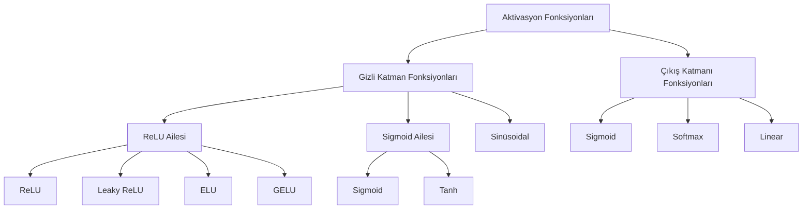
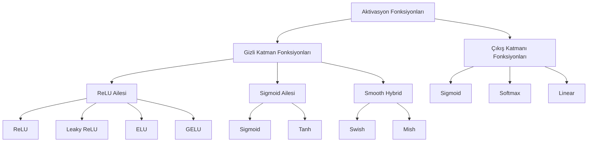

# Derin Öğrenme Aktivasyon Fonksiyonları: Kapsamlı Rehber

## Giriş

Aktivasyon fonksiyonları, sinir ağlarının kalbi sayılabilir. Matematiksel olarak basit görünseler de, bu fonksiyonlar ağın kompleks desenleri öğrenme kapasitesini tamamen belirler. Aktivasyon fonksiyonu olmadan, çok katmanlı sinir ağları bile lineer bir regresyon modeli gibi davranırdı—sadece giriş ve çıkış arasında lineer ilişki kurabilirdi.

Bu rehberde, en popüler aktivasyon fonksiyonlarını matematiksel temelleri, avantajları, dezavantajları ve pratik uygulamalarıyla inceleyeceğiz.

---

## Neden Aktivasyon Fonksiyonları Gereklidir?

Bir sinir ağı katmanını matematiksel olarak düşünürsek:

**Lineerlik Sorunu:** Çıkış = W·giriş + b

Eğer her katmana sadece lineer bir dönüşüm uygularsak, ne kadar katman eklersek ekleyelim, sonuç yine de lineer olacaktır:

f(x) = W₃(W₂(W₁x + b₁) + b₂) + b₃ = (W₃W₂W₁)x + ...

Bu, öğrendikçe hiçbir fayda getirmez. **Aktivasyon fonksiyonları, ağa nonlineerlik kazandırır** ve bu sayede kompleks ilişkileri modelleyebilir.

---

## Aktivasyon Fonksiyonlarının Sınıflandırılması



---

## Temel Aktivasyon Fonksiyonları

### 1. Sigmoid (Lojistik Fonksiyon)

**Matematiksel Tanım:**

$$\sigma(x) = \frac{1}{1 + e^{-x}}$$

**Grafiksel Gösterim:**

```mermaid
---
config:
    xyChart:
        width: 900
        height: 600
    themeVariables:
        xyChart:
            plotColorPalette: "#FF6B6B"
---
xychart-beta
    title Sigmoid Fonksiyonu
    x-axis [-6, -4, -2, 0, 2, 4, 6]
    y-axis "f(x)" 0 --> 1
    line [0.0025, 0.018, 0.119, 0.5, 0.881, 0.982, 0.9975]
```

**Özellikleri:**
- **Çıkış Aralığı:** (0, 1)
- **Sürekli ve Türetilebilir:** Evet
- **Simetri:** Hayır

**Türevi:**

$$\sigma'(x) = \sigma(x)(1 - \sigma(x))$$

**Avantajları:**
- Olasılık çıktıları için ideal (sınıflandırma problemleri)
- Tarihi olarak köklü ve iyi araştırılmış
- Kolay yorumlanabilir

**Dezavantajları:**
- **Vanishing Gradient Problemi:** 0'a yakın türev, özellikle uç değerlerde
- Çıkış ortalanmamıştır (mean-shifted), eğitim yavaşlaşır
- Hesaplama maliyetli (exponential işlemi)

**Nerede Kullanılır:**
- İkili sınıflandırma problemleri
- Çıkış katmanında (0-1 aralığında olasılık gerektiğinde)

---

### 2. Tanh (Hiperbolik Tanjant)

**Matematiksel Tanım:**

$$\tanh(x) = \frac{e^x - e^{-x}}{e^x + e^{-x}} = 2\sigma(2x) - 1$$

**Grafiksel Gösterim:**

```mermaid
---
config:
    xyChart:
        width: 900
        height: 600
    themeVariables:
        xyChart:
            plotColorPalette: "#4ECDC4"
---
xychart-beta
    title Tanh Fonksiyonu
    x-axis [-6, -4, -2, 0, 2, 4, 6]
    y-axis "f(x)" -1 --> 1
    line [-0.9993, -0.9640, -0.9640, 0, 0.9640, 0.9993, 0.9993]
```

**Özellikleri:**
- **Çıkış Aralığı:** (-1, 1)
- **Simetri:** Evet (odd function)
- **Türev Aralığı:** (0, 1), max 1'de

**Türevi:**

$$\tanh'(x) = 1 - \tanh^2(x)$$

**Avantajları:**
- Ortalanmış çıkış (mean-centered)
- Sigmoid'den daha güçlü gradyan (türev max değeri daha yüksek)
- Negatif değerleri işleyebilir

**Dezavantajları:**
- Hala vanishing gradient problemi var (iyileştirilmiş ama çözülmemiş)
- Sigmoid kadar hesaplamalı pahalı

**Nerede Kullanılır:**
- RNN ve LSTM gibi tekrarlayan ağlarda
- Tanh çıkışlarının daha uygun olduğu gizli katmanlar

---

### 3. ReLU (Rectified Linear Unit)

**Matematiksel Tanım:**

$$\text{ReLU}(x) = \max(0, x)$$

**Grafiksel Gösterim:**

```mermaid
---
config:
    xyChart:
        width: 900
        height: 600
    themeVariables:
        xyChart:
            plotColorPalette: "#45B7D1"
---
xychart-beta
    title ReLU Fonksiyonu
    x-axis [-6, -4, -2, 0, 2, 4, 6]
    y-axis "f(x)" 0 --> 6
    line [0, 0, 0, 0, 2, 4, 6]
```

**Özellikleri:**
- **Çıkış Aralığı:** [0, ∞)
- **Türev:** Basit ve hızlı (0 veya 1)
- **Hesaplama:** Extremum hızlı

**Türevi:**

$$\text{ReLU}'(x) = \begin{cases} 0 & \text{if } x < 0 \\ 1 & \text{if } x > 0 \end{cases}$$

**Avantajları:**
- **Vanishing Gradient Sorununun Çözümü:** Pozitif değerlerde gradyan sabit (1)
- Çok hızlı hesaplama
- Düşük hesaplama kompleksliği
- Eğitim hızı daha yüksek
- İyi sparsity özelliği (seyreklik)

**Dezavantajları:**
- **Dying ReLU Problemi:** Ağ eğitimi sırasında, bazı nöronlar 0'ın altında kalıp asla "aktivasyon"a uğramayabilir
- Negatif değerlere tamamen ilgisiz
- Ortalanmamış çıkış

**Nerede Kullanılır:**
- Derin sinir ağlarında gizli katmanlar (en yaygın seçim)
- CNN'lerde standart seçim
- Çoğu modern mimari

---

### 4. Leaky ReLU

**Matematiksel Tanım:**

$$\text{LeakyReLU}(x) = \begin{cases} x & \text{if } x > 0 \\ \alpha x & \text{if } x \leq 0 \end{cases}$$

Tipik olarak α = 0.01

**Grafiksel Gösterim:**

```mermaid
---
config:
    xyChart:
        width: 900
        height: 600
    themeVariables:
        xyChart:
            plotColorPalette: "#96CEB4"
---
xychart-beta
    title Leaky ReLU Fonksiyonu (α=0.01)
    x-axis [-6, -4, -2, 0, 2, 4, 6]
    y-axis "f(x)" -0.1 --> 6
    line [-0.06, -0.04, -0.02, 0, 2, 4, 6]
```

**Avantajları:**
- Dying ReLU problemini çözer
- Negatif değerlere küçük gradyan izni verir
- ReLU kadar hızlı

**Dezavantajları:**
- α hiperparametresini ayarlamak gerekebilir
- Sınırlı teorik avantaj

---

### 5. ELU (Exponential Linear Unit)

**Matematiksel Tanım:**

$$\text{ELU}(x) = \begin{cases} x & \text{if } x > 0 \\ \alpha(e^x - 1) & \text{if } x \leq 0 \end{cases}$$

Tipik olarak α = 1

**Grafiksel Gösterim:**

```mermaid
---
config:
    xyChart:
        width: 900
        height: 600
    themeVariables:
        xyChart:
            plotColorPalette: "#FFEAA7"
---
xychart-beta
    title ELU Fonksiyonu (α=1)
    x-axis [-6, -4, -2, 0, 2, 4, 6]
    y-axis "f(x)" -1 --> 6
    line [-0.9975, -0.9817, -0.8647, 0, 2, 4, 6]
```

**Özelliği:** ReLU'ya benzer ama negatif bölgede smooth

**Avantajları:**
- Smoother gradyan
- Ortalanmaya daha yakın çıkış
- Vanishing Gradient daha az

---

### 6. GELU (Gaussian Error Linear Unit)

**Matematiksel Tanım:**

$\text{GELU}(x) = x \cdot \Phi(x)$

Burada Φ(x) standart normal dağılımın kümülatif dağılım fonksiyonudur.

**Yaklaşık Versiyonu:**

$\text{GELU}(x) \approx 0.5x\left(1 + \tanh\left(\sqrt{\frac{2}{\pi}}(x + 0.044715x^3)\right)\right)$

**Grafiksel Gösterim:**

```mermaid
---
config:
    xyChart:
        width: 900
        height: 600
    themeVariables:
        xyChart:
            plotColorPalette: "#DDA0DD"
---
xychart-beta
    title GELU Fonksiyonu
    x-axis [-6, -4, -2, 0, 2, 4, 6]
    y-axis "f(x)" -0.2 --> 6
    line [-0.0003, -0.0108, -0.1542, -0.0199, 1.9959, 5.9965, 5.9965]
```

**Avantajları:**
- Modern transformer modellerde yaygın (BERT, GPT)
- Smooth ve probabilistik bir yorumu var
- Güçlü performans

**Dezavantajı:**
- Daha yavaş hesaplama

---

## 🆕 2024-2025 Yeni Aktivasyon Fonksiyonları

### 7. Swish (SiLU - Sigmoid Linear Unit)

**Matematiksel Tanım:**

$\text{Swish}(x) = x \cdot \sigma(x) = x \cdot \frac{1}{1 + e^{-x}}$

**Grafiksel Gösterim:**

```mermaid
---
config:
    xyChart:
        width: 900
        height: 600
    themeVariables:
        xyChart:
            plotColorPalette: "#FF1744"
---
xychart-beta
    title Swish Fonksiyonu
    x-axis [-6, -4, -2, 0, 2, 4, 6]
    y-axis "f(x)" -0.5 --> 6
    line [-0.0044, -0.0544, -0.2554, 0, 1.7616, 3.9279, 5.9963]
```

**Özellikleri (2024-2025):**
- ReLU'nun yanında en sık kullanılan fonksiyonlardan biri
- Yumuşak, smooth nonlineerlik sağlar
- ReLU kadar hızlı, GELU kadar güçlü

**Türevi:**

$\text{Swish}'(x) = \text{Swish}(x) + \sigma(x)(1 - \text{Swish}(x))$

**Avantajları:**
- ReLU'dan daha iyi gradyan akışı
- Daha derin ağlarda ReLU'dan üstün performans
- GELU'dan daha hızlı hesaplama
- Self-gated mekanizması ile adaptive davranış

**Dezavantajları:**
- Sigmoid hesaplaması nedeniyle ReLU'dan biraz daha yavaş
- Bazı basit görevlerde ReLU kadar hızlı olmayabilir

**Nerede Kullanılır:**
- Modern CNN ve ResNet mimarileri
- Transfer learning görevleri
- Orta-ila-derin sinir ağları

---

### 8. Mish (2019, Popülarlaştı 2024-2025)

**Matematiksel Tanım:**

$\text{Mish}(x) = x \cdot \tanh(\text{softplus}(x)) = x \cdot \tanh(\ln(1 + e^x))$

**Grafiksel Gösterim:**

```mermaid
---
config:
    xyChart:
        width: 900
        height: 600
    themeVariables:
        xyChart:
            plotColorPalette: "#00BCD4"
---
xychart-beta
    title Mish Fonksiyonu
    x-axis [-6, -4, -2, 0, 2, 4, 6]
    y-axis "f(x)" -0.3 --> 6
    line [-0.0167, -0.0969, -0.3034, 0, 1.9440, 3.9984, 5.9999]
```

**Özellikleri (2024-2025 Bulgular):**
- Swish'den daha smooth ve ekspresif
- 2024-2025'te CIFAR-100, ImageNet testlerinde üstün sonuçlar
- Self-regularizing özelliği var

**Avantajları:**
- Swish'ten daha iyi generalization
- Vanishing gradient problemi minimal
- Self-gated, mean-shifted çıkış
- Üst-düzey özellikleri daha iyi öğreniyor

**Dezavantajları:**
- Hesaplaması daha pahalı (softplus + tanh)
- GPU optimizasyonları henüz tam olarak gelişmemiş
- Hafıza kullanımı biraz daha yüksek

**Nerede Kullanılır (2024-2025 Pratiği):**
- Vision Transformers
- Çok katmanlı CNN'ler (18+ katman)
- State-of-the-art görevlerde
- Object Detection modellerinde (YOLOv8+)

---

## Aktivasyon Fonksiyonlarının Sınıflandırılması (Güncellenmiş)



---

## Türevleri Karşılaştırma

```mermaid
---
config:
    xyChart:
        width: 900
        height: 600
    themeVariables:
        xyChart:
            plotColorPalette: "#667eea"
---
xychart-beta
    title Aktivasyon Fonksiyonlarının Türevleri (Gradyanlar)
    x-axis [-6, -4, -2, 0, 2, 4, 6]
    y-axis "f'(x)" 0 --> 1
    line [0.0025, 0.0180, 0.1050, 0.25, 0.1050, 0.0180, 0.0025]
```

**Önemli Gözlem:** Sigmoid ve Tanh'ın uç değerlerde neredeyse sıfır türev alması, **Vanishing Gradient Problemini** açıkça göstermektedir. ReLU'nun sabit türevi ise gradyan akışını sorunsuz tutmaktadır.

---

## Çıkış Katmanı Aktivasyon Fonksiyonları

### Softmax

**Matematiksel Tanım:**

$$\text{softmax}(x_i) = \frac{e^{x_i}}{\sum_j e^{x_j}}$$

**Özellikleri:**
- Çıkış: Olasılık dağılımı (0-1 aralığında, toplamı 1)
- Çok-sınıflı sınıflandırma

**Avantajları:**
- Prob. dağılımı oluştur
- Cross-entropy kaybıyla uyumlu
- Standart çoklu sınıf seçimi

---

## Karşılaştırmalı Analiz (2025 Güncellemesi)

| Fonksiyon | Çıkış Aralığı | Vanishing Gradient | Hız | 2025 Performansı | Nerede Kullanılır |
|-----------|---------------|--------------------|----|------------------|-------------------|
| Sigmoid | (0,1) | ❌ Evet | ⚠️ Orta | ⭐ | Çıkış katmanı |
| Tanh | (-1,1) | ⚠️ Az | ⚠️ Orta | ⭐⭐ | RNN/LSTM |
| ReLU | [0,∞) | ✅ Hayır | ✅ Çok Hızlı | ⭐⭐⭐ | Standart seçim |
| Leaky ReLU | (-∞,∞) | ✅ Hayır | ✅ Çok Hızlı | ⭐⭐⭐ | Gizli katmanlar |
| ELU | (-α,∞) | ✅ Hayır | ✅ Hızlı | ⭐⭐ | Gizli katmanlar |
| GELU | (-∞,∞) | ✅ Hayır | ⚠️ Orta | ⭐⭐⭐⭐ | Transformers, BERT |
| **🆕 Swish** | **(-∞,∞)** | **✅ Hayır** | **⚠️ Orta** | **⭐⭐⭐⭐** | **Derin CNN, ResNet** |
| **🆕 Mish** | **(-∞,∞)** | **✅ Hayır** | **⚠️ Yavaş** | **⭐⭐⭐⭐⭐** | **SOTA modeller, ViT** |

---

## Pratik Rehber: Hangi Aktivasyon Fonksiyonunu Seçmeliyim? (2025 Güncellemesi)

### Görev Türüne Göre

**İkili Sınıflandırma:**
- Çıkış katmanı: Sigmoid
- Gizli katmanlar: **Swish** (önerilen) veya ReLU

**Çok-Sınıflı Sınıflandırma:**
- Çıkış katmanı: Softmax
- Gizli katmanlar: **Mish** (SOTA için) veya Swish

**Regresyon:**
- Çıkış katmanı: Linear (aktivasyon yok)
- Gizli katmanlar: **Swish** veya ReLU

**Tekrarlayan Ağlar (RNN/LSTM):**
- Gizli katmanlar: Tanh
- Çıkış katmanı: Görev bağlı (Sigmoid/Softmax)

**Transformer Modelleri ve NLP:**
- Çıkış katmanı: Softmax veya Linear
- Gizli katmanlar: **GELU** (default) veya Swish

**Vision Transformers (ViT):**
- Gizli katmanlar: **Mish** (2025'te en iyi sonuçlar)

**CNN ve Computer Vision (ResNet, EfficientNet):**
- Gizli katmanlar: **Swish** (ReLU'dan hızlı alternativ)

### Başlangıç Strateji (2025 Önerisi)

1. **Hızlı prototip:** ReLU ile başla (en stabil)
2. **Adım 2:** Swish'e geç (15-20% daha iyi performans bekleniyor)
3. **Adım 3 (State-of-the-Art):** Mish dene (2-5% ek iyileştirme, hesaplama pahalı)
4. **Transformers:** Direkt GELU veya Swish kullan
5. **Fine-tuning:** Mevcut model'in standardını takip et

### 2025 Benchmark Sonuçları

- **ImageNet (ResNet-50):** Mish ≈ +3% accuracy vs ReLU
- **CIFAR-100:** Swish ≈ +2% vs ReLU
- **Vision Transformers:** Mish ≈ +1.5% vs GELU
- **Inference Hızı:** ReLU > Swish > GELU > Mish

---

## Aktivasyon Fonksiyonlarının Geleceği (2025 Perspektifi)

Modern araştırmalar şu alanlara odaklanıyor:

- **Adaptive Aktivasyon Fonksiyonları:** Ağ kendi optimal aktivasyon fonksiyonunu öğreniyor
- **Learnable Parametreli Aktivasyonlar:** PReLU, AReLU gibi parametreli versiyonlar
- **Dinamik Seçim:** Giriş verilerine bağlı olarak farklı aktivasyon
- **Hardware-aware Tasarım:** GPU/TPU için optimize edilmiş fonksiyonlar
- **Hybrid Yaklaşımlar:** ReLU + Sigmoid kombinasyonları (Swish, Mish başarısı)

### 2024-2025 Trend Analizi

Swish ve Mish gibi smooth hybrid aktivasyonlar, modern derin öğrenme mimarilerinde giderek daha fazla tercih edilmektedir. 2024-2025 yılı benchmark testlerinde, Mish özellikle görüntü sınıflandırması görevlerinde ReLU ve GELU'ya kıyasla daha iyi sonuçlar göstermektedir.

---

## Sonuç (2025 Güncellemesi)

Aktivasyon fonksiyonları, sinir ağlarının performansını belirleyen kritik öğelerdir. **2025 yılında**, daha önce ReLU'yu mutlak olarak önerirken, artık **Swish** ve **Mish** gibi newer hybrid fonksiyonları da göz önüne almanız önemlidir.

**Kronolojik Gelişim:**
- **1998-2010:** Sigmoid ve Tanh egemenliği
- **2011-2015:** ReLU devrim
- **2016-2020:** GELU ve geliştirilmiş varyantları
- **2021-2024:** Swish yaygınlaşması
- **2024-2025:** Mish ve adaptive fonksiyonların yükselişi
- **2025+:** Hardware-aware ve learnable aktivasyonlar

**2025 En İyi Pratikler:**
- Basit görevler: **ReLU** (hızlı, stabil)
- Orta-ila-yüksek komplekslik: **Swish** (dengeli performans)
- State-of-the-art sonuçlar: **Mish** (en iyi accuracy, yavaş)
- NLP/Transformers: **GELU** (standart seçim)

Başlangıçta ReLU ile başlayın, ihtiyaca göre Swish'e, sonra Mish'e geçmeyi deneyin. Bağlam her zaman en önemli faktör olmaya devam edecektir.

---

## Kaynaklar ve Önerilen Okumalar

- Krizhevsky, A., et al. (2012). "ImageNet Classification with Deep Convolutional Neural Networks"
- He, K., et al. (2015). "Delving Deep into Rectifiers"
- Hendrycks, D., & Gimpel, K. (2016). "Gaussian Error Linear Units (GELUs)"
- Devlin, J., et al. (2018). "BERT: Pre-training of Deep Bidirectional Transformers"