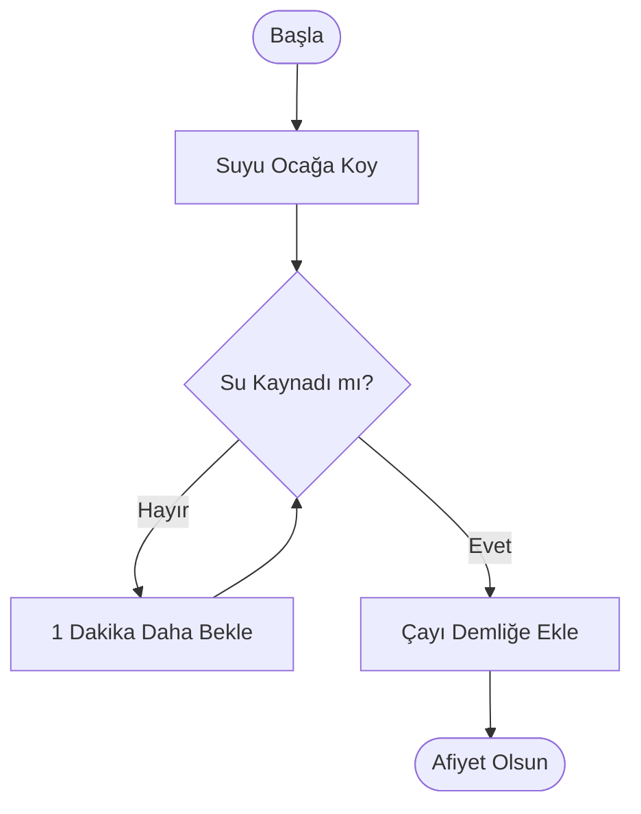

# Bölüm 02: Algoritma Nedir? (Sıralı Adımlar Sanatı)

Yazılım denilince akla hemen ekranda akan yeşil kodlar (Matrix filmi gibi) gelir. Ancak gerçekte, kod yazmak işin en son ve en kolay kısmıdır. Önemli olan "Algoritma" kurabilmektir.

---

## 1. Algoritma Nedir?
Algoritma, en basit tabiriyle **bir problemi çözmek için izlenmesi gereken mantıksal ve sıralı adımlar bütünüdür.** Bilgisayarlara özgü bir kelime değildir. Aslında hayatınızın her anında algoritmaları kullanıyorsunuz.

**Örneğin: Çay Demleme Algoritması**
Diyelim ki hayatında hiç çay demlememiş bir uzaylıya çay demlemeyi öğreteceksiniz. Ona sadece "Çay demle" derseniz hiçbir şey yapamaz. Adımları tek tek, sırasıyla vermelisiniz:
1. Çaydanlığın alt kısmına su koy.
2. Ocağı yak ve çaydanlığı ocağa koy.
3. Suyun kaynamasını bekle.
4. Su kaynadığında, üst demliğe 3 kaşık çay koy.
5. Kaynar suyu üst demliğe dök.
6. Alt çaydanlığa tekrar su ekle ve ocağın altını kıs.
7. 15 dakika bekle.
8. Çayı servis et.

İşte bu bir **Algoritmadır**. 

## 2. Sıralama Neden Önemlidir?
Yukarıdaki algoritmayı düşünün. Eğer 3. adım (Suyu kaynat) ile 5. adımı (Suyu demliğe dök) yer değiştirirseniz ne olur? Soğuk suyu demliğe dökmüş olursunuz ve sistem (çay) **çöker (Crash verir).**
Bilgisayarlar da tıpkı bu uzaylı gibidir. Adımların sırası bir milimetre bile şaşarsa, milyon dolarlık bir uygulama saniyeler içinde hata verir.

## 3. Akış Diyagramı (Flowchart)
Yazılımcılar bu adımları koda dökmeden önce, kağıt üzerinde şekillerle çizerler. Buna "Akış Diyagramı" denir.

Algoritma zihniyeti, karmaşık bir kaosu, aptala anlatır gibi minik ve mantıklı adımlara bölme sanatıdır.
