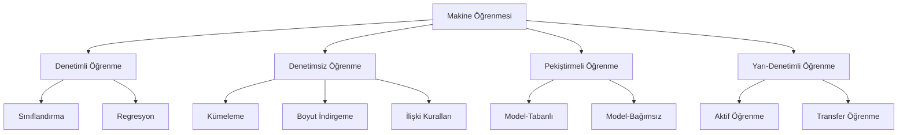
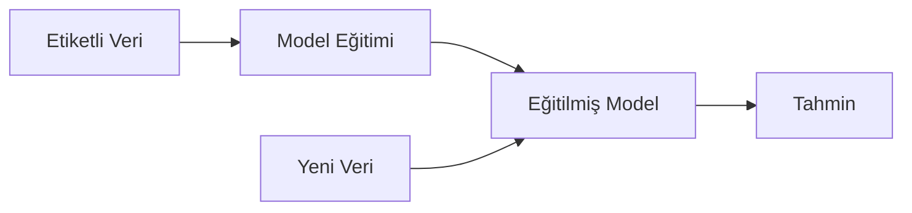
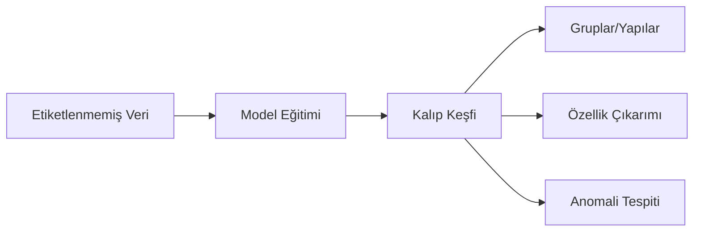
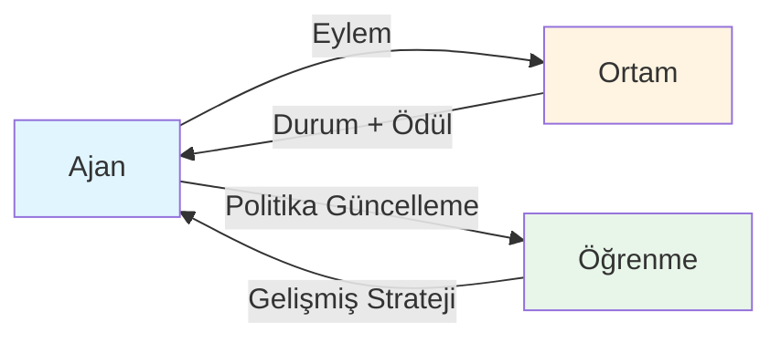
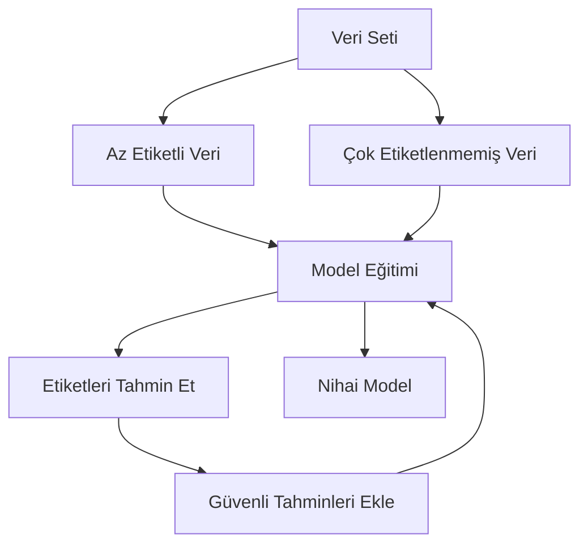

# Makine Öğrenmesi Türleri

## İçindekiler
1. [Giriş](#giriş)
2. [Denetimli Öğrenme](#denetimli-öğrenme)
3. [Denetimsiz Öğrenme](#denetimsiz-öğrenme)
4. [Pekiştirmeli Öğrenme](#pekiştirmeli-öğrenme)
5. [Yarı-Denetimli Öğrenme](#yarı-denetimli-öğrenme)
6. [Karşılaştırmalı Tablo](#karşılaştırmalı-tablo)
7. [Teknik Terimler Sözlüğü](#teknik-terimler-sözlüğü)

---

## Giriş

Makine öğrenmesi (ML), bilgisayarların açıkça programlanmadan verilerden öğrenmesini ve deneyimlerle gelişmesini sağlayan yapay zekanın bir alt dalıdır. Makine öğrenmesi, temelde dört ana türe ayrılır: denetimli öğrenme, denetimsiz öğrenme, pekiştirmeli öğrenme ve yarı-denetimli öğrenme.

---

## Denetimli Öğrenme

### Nedir?

Denetimli öğrenme, etiketli veri setleri kullanılarak modelin eğitildiği bir makine öğrenmesi türüdür. Her veri noktası bir giriş (özellikler) ve karşılık gelen bir çıkış (etiket/hedef) içerir. Model, giriş ve çıkış arasındaki ilişkiyi öğrenerek yeni, görülmemiş veriler üzerinde tahminler yapabilir.

### Alt Türleri

**1. Sınıflandırma (Classification)**
- Verileri önceden tanımlanmış kategorilere ayırma
- Örnekler: spam tespiti, görüntü tanıma, hastalık teşhisi

**2. Regresyon (Regression)**
- Sürekli sayısal değerleri tahmin etme
- Örnekler: ev fiyat tahmini, hisse senedi fiyat tahmini, sıcaklık tahmini

### Kullanım Alanları

- **Finansal Hizmetler**: Kredi risk değerlendirmesi, dolandırıcılık tespiti, algoritmik ticaret
- **Sağlık**: Hastalık teşhisi, hasta sonuçlarını tahmin etme, ilaç keşfi
- **E-Ticaret**: Müşteri segmentasyonu, ürün önerisi, talep tahmini
- **Otomotiv**: Otonom araç sistemleri, bakım tahmini
- **Doğal Dil İşleme**: Duygu analizi, makine çevirisi, metin sınıflandırma

### Avantajları

- **Yüksek Doğruluk**: Yeterli etiketli veri ile çok yüksek doğruluk oranları elde edilebilir
- **Net Hedefler**: Başarı metrikleri açıkça tanımlanabilir
- **Geniş Uygulama Alanı**: Birçok gerçek dünya problemine uygulanabilir
- **Olgunlaşmış Algoritmalar**: Kanıtlanmış ve iyi anlaşılmış algoritmalar mevcut
- **Ölçülebilir Performans**: Model performansı kolayca değerlendirilebilir

### Dezavantajları

- **Veri Etiketleme Maliyeti**: Etiketli veri toplamak zaman alıcı ve pahalıdır
- **Aşırı Öğrenme Riski**: Model eğitim verilerine çok fazla uyum sağlayabilir
- **Sınırlı Genelleme**: Sadece eğitim verisinde gördüklerine benzer örneklerde iyi çalışır
- **Etiket Kalitesi Bağımlılığı**: Hatalı etiketler model performansını düşürür
- **Veri Dengesizliği Sorunları**: Dengesiz veri setlerinde zayıf performans gösterebilir

### Popüler Algoritmalar

- Doğrusal Regresyon ve Lojistik Regresyon
- Karar Ağaçları ve Rastgele Ormanlar
- Destek Vektör Makineleri (SVM)
- Naive Bayes
- K-En Yakın Komşu (KNN)
- Sinir Ağları ve Derin Öğrenme

---

## Denetimsiz Öğrenme

### Nedir?

Denetimsiz öğrenme, etiketlenmemiş verilerden model eğitimi yapılan bir makine öğrenmesi türüdür. Model, veri içindeki gizli yapıları, kalıpları ve ilişkileri keşfetmeye çalışır. Bu yaklaşımda önceden tanımlanmış doğru cevaplar yoktur.

### Alt Türleri

**1. Kümeleme (Clustering)**
- Benzer veri noktalarını gruplara ayırma
- Örnekler: müşteri segmentasyonu, belge gruplaması, görüntü bölütleme

**2. Boyut İndirgeme (Dimensionality Reduction)**
- Veri karmaşıklığını azaltırken önemli bilgileri koruma
- Örnekler: görselleştirme, özellik seçimi, gürültü azaltma

**3. İlişki Kuralları (Association Rules)**
- Veri içindeki ilginç ilişkileri keşfetme
- Örnekler: market sepet analizi, ürün önerisi

### Kullanım Alanları

- **Pazarlama**: Müşteri segmentasyonu, pazar araştırması, hedef kitle belirleme
- **Anomali Tespiti**: Siber güvenlik, dolandırıcılık tespiti, kalite kontrol
- **Biyoinformatik**: Gen ifade analizi, protein yapısı analizi
- **Görüntü İşleme**: Görüntü sıkıştırma, özellik çıkarımı, segmentasyon
- **Öneri Sistemleri**: Benzer ürün/içerik bulma, işbirlikçi filtreleme

### Avantajları

- **Etiket Gerekmez**: Maliyetli etiketleme sürecine ihtiyaç duyulmaz
- **Keşif Odaklı**: Beklenmedik kalıpları ve içgörüleri ortaya çıkarabilir
- **Veri Yapısını Anlama**: Veri setinin temel yapısını ve dağılımını öğrenir
- **Ölçeklenebilirlik**: Büyük veri setlerine uygulanabilir
- **Ön İşleme İçin Yararlı**: Denetimli öğrenme öncesi veri hazırlığında kullanılır

### Dezavantajları

- **Belirsiz Sonuçlar**: Sonuçların yorumlanması zor olabilir
- **Performans Ölçümü Zorluğu**: Başarı metriklerini tanımlamak subjektiftir
- **Parametre Hassasiyeti**: Algoritma parametreleri sonuçları önemli ölçüde etkiler
- **Garanti Edilemeyen Doğruluk**: Bulunan kalıpların anlamlılığı belirsiz olabilir
- **Domain Bilgisi Gerektirir**: Sonuçları değerlendirmek için uzman bilgisi gerekir

### Popüler Algoritmalar

- K-Means ve Hiyerarşik Kümeleme
- DBSCAN (Density-Based Spatial Clustering)
- Temel Bileşen Analizi (PCA)
- t-SNE ve UMAP
- Apriori Algoritması
- Otokodlayıcılar (Autoencoders)
- Üretici Çekişmeli Ağlar (GAN)

---

## Pekiştirmeli Öğrenme

### Nedir?

Pekiştirmeli öğrenme, bir ajanın bir ortamda etkileşimde bulunarak deneme-yanılma yoluyla öğrendiği makine öğrenmesi türüdür. Ajan, belirli hedeflere ulaşmak için ödüller maksimize edecek ve cezaları minimize edecek şekilde eylemler seçmeyi öğrenir.

### Temel Bileşenler

- **Ajan**: Karar veren ve öğrenen varlık
- **Ortam**: Ajanın etkileşimde bulunduğu sistem
- **Durum**: Ortamın mevcut konfigürasyonu
- **Eylem**: Ajanın yapabileceği hareketler
- **Ödül**: Eylem sonucunda alınan geri bildirim
- **Politika**: Durumlara göre eylem seçme stratejisi

### Kullanım Alanları

- **Oyun Yapay Zekası**: Go, satranç, video oyunları (AlphaGo, OpenAI Five)
- **Robotik**: Robot kontrolü, manipülasyon, navigasyon
- **Otonom Sistemler**: Sürücüsüz araçlar, drone kontrolü
- **Kaynak Yönetimi**: Veri merkezi soğutma, enerji optimizasyonu
- **Finans**: Algoritmik ticaret, portföy optimizasyonu
- **Sağlık**: Tedavi stratejisi optimizasyonu, kişiselleştirilmiş tıp

### Avantajları

- **Karmaşık Problemler**: Geleneksel yöntemlerle çözülemeyen problemleri ele alabilir
- **Uzun Vadeli Optimizasyon**: Kısa vadeli ödülleri değil, uzun vadeli hedefleri optimize eder
- **Adaptif Davranış**: Değişen ortamlara uyum sağlayabilir
- **İnsan Müdahalesi Minimal**: Sürekli denetim gerektirmez
- **Keşif ve İstismar Dengesi**: Yeni stratejiler keşfedip bilinen iyi stratejileri kullanır

### Dezavantajları

- **Eğitim Süresi**: Öğrenme süreci çok uzun olabilir
- **Ödül Fonksiyonu Tasarımı**: Doğru ödül fonksiyonu tanımlamak zordur
- **Örnek Verimsizliği**: Çok sayıda deneme gerektirir
- **Kararlılık Sorunları**: Eğitim sürecinde kararsızlık yaşanabilir
- **Simülasyon-Gerçeklik Farkı**: Simülasyonda öğrenilen gerçek dünyada çalışmayabilir
- **Hesaplama Maliyeti**: Yüksek hesaplama gücü gerektirir

### Popüler Algoritmalar

- Q-Learning ve Deep Q-Networks (DQN)
- SARSA (State-Action-Reward-State-Action)
- Actor-Critic Yöntemleri
- Proximal Policy Optimization (PPO)
- Deep Deterministic Policy Gradient (DDPG)
- Monte Carlo Tree Search (MCTS)
- AlphaZero ve MuZero

---

## Yarı-Denetimli Öğrenme

### Nedir?

Yarı-denetimli öğrenme, hem etiketli hem de etiketlenmemiş verileri birlikte kullanarak model eğitimi yapan bir hibrit yaklaşımdır. Genellikle az miktarda etiketli veri ve çok miktarda etiketlenmemiş veri bulunduğunda kullanılır.

### Yaklaşımlar

**1. Self-Training (Kendi Kendini Eğitme)**
- Model kendi tahminlerini etiket olarak kullanır

**2. Co-Training**
- Farklı özellik setleriyle birden fazla model eğitilir

**3. Multi-view Learning**
- Verinin farklı görünümlerinden yararlanılır

**4. Graph-based Methods**
- Veri noktaları arasındaki ilişkileri graf yapısıyla modeller

### Kullanım Alanları

- **Metin Sınıflandırma**: Web sayfası kategorilendirme, spam filtreleme
- **Görüntü Tanıma**: Az etiketli veri ile görüntü sınıflandırma
- **Ses Tanıma**: Konuşma tanıma sistemleri
- **Biyoinformatik**: Protein fonksiyon tahmini
- **Doğal Dil İşleme**: Duygu analizi, varlık tanıma

### Avantajları

- **Maliyet Etkin**: Etiketleme maliyetini azaltır
- **Performans İyileştirmesi**: Sadece etiketli veriye göre daha iyi sonuçlar verir
- **Pratik**: Gerçek dünya senaryolarına uygun (etiket azlığı yaygındır)
- **Veri Verimliliği**: Mevcut etiketlenmemiş veriden yararlanır

### Dezavantajları

- **Etiket Yayılma Hatası**: Yanlış tahminler eğitim setine dahil olabilir
- **Model Karmaşıklığı**: Uygulaması daha karmaşıktır
- **Varsayımlara Bağımlılık**: Veri dağılımı hakkında varsayımlara dayanır
- **Garanti Edilmeyen İyileştirme**: Her zaman performansı artırmayabilir
- **Hiperparametre Hassasiyeti**: Doğru parametreleri bulmak zordur

### Popüler Algoritmalar

- Pseudo-labeling
- Label Propagation
- Co-Training
- Tri-Training
- Transductive SVM
- Ladder Networks

---

## Karşılaştırmalı Tablo

| Özellik | Denetimli | Denetimsiz | Pekiştirmeli | Yarı-Denetimli |
|---------|-----------|------------|--------------|----------------|
| **Veri Tipi** | Etiketli | Etiketlenmemiş | Ödül sinyalleri | Karma (az etiketli + çok etiketlenmemiş) |
| **Amaç** | Tahmin yapma | Kalıp keşfi | Optimum politika | Tahmin yapma (az etiketle) |
| **Geri Bildirim** | Doğrudan | Yok | Gecikmeli ödül | Kısmi doğrudan |
| **Eğitim Maliyeti** | Yüksek | Düşük | Çok yüksek | Orta |
| **Doğruluk** | Yüksek | Değişken | Değişken | Orta-Yüksek |
| **Uygulama Zorluğu** | Orta | Orta | Yüksek | Yüksek |
| **Örnek Kullanım** | Spam tespiti | Müşteri segmentasyonu | Oyun AI | Web sayfası sınıflandırma |
| **En İyi Senaryo** | Bol etiketli veri | Keşif amaçlı analiz | Sekansiyel kararlar | Az etiketli veri |

---

## Ek Bilgiler

### Model Seçimi Kriterleri

Proje için hangi makine öğrenmesi türünün seçileceğine karar verirken şu faktörler göz önünde bulundurulmalıdır:

1. **Veri Durumu**
   - Etiketli veri miktarı ve kalitesi
   - Etiketleme maliyeti ve fizibilitesi
   - Veri setinin büyüklüğü

2. **Problem Tipi**
   - Tahmin mi yoksa keşif mi?
   - Gerçek zamanlı karar verme gerekli mi?
   - Uzun vadeli optimizasyon gerekli mi?

3. **Kaynaklar**
   - Hesaplama gücü
   - Zaman kısıtlamaları
   - Bütçe

4. **İş Gereksinimleri**
   - Doğruluk beklentisi
   - Yorumlanabilirlik ihtiyacı
   - Düzenleyici gereksinimler

### Hibrit Yaklaşımlar

Modern uygulamalarda genellikle birden fazla öğrenme türü birlikte kullanılır:

- **Transfer Öğrenme**: Denetimli öğrenmeyle eğitilmiş modelin diğer görevlere uyarlanması
- **Aktif Öğrenme**: Model, hangi verilerin etiketlenmesi gerektiğine karar verir
- **Meta-Öğrenme**: "Öğrenmeyi öğrenme" yaklaşımı
- **Çok Görevli Öğrenme**: Birden fazla ilişkili görevi aynı anda öğrenme

### Gelecek Trendleri

- **Federe Öğrenme**: Merkezi olmayan, gizlilik koruyan öğrenme
- **Kendini Denetleyen Öğrenme**: Büyük etiketlenmemiş veri setlerinden öğrenme
- **Nöro-sembolik AI**: Sinir ağları ve sembolik mantığın entegrasyonu
- **Az Atışlı Öğrenme**: Çok az örnekle öğrenme
- **Sürekli Öğrenme**: Önceki bilgileri unutmadan yeni görevler öğrenme

---

## Teknik Terimler Sözlüğü

**Ajan (Agent)**: Pekiştirmeli öğrenmede kararlar alan ve öğrenen varlık.

**Anomali Tespiti (Anomaly Detection)**: Normal kalıplardan sapan veri noktalarını tanımlama.

**Aşırı Öğrenme (Overfitting)**: Modelin eğitim verisine çok fazla uyum sağlayarak genelleme yeteneğini kaybetmesi.

**Boyut İndirgeme (Dimensionality Reduction)**: Veri karmaşıklığını azaltmak için özellik sayısını düşürme.

**Etiket (Label)**: Denetimli öğrenmede veri noktalarının sahip olduğu hedef değer veya kategori.

**Geri Yayılım (Backpropagation)**: Sinir ağlarında hataların geriye doğru yayılarak ağırlıkların güncellenmesi süreci.

**Hiperparametre (Hyperparameter)**: Model eğitimi öncesinde ayarlanan ve eğitim sırasında değişmeyen parametreler.

**İstismar (Exploitation)**: Pekiştirmeli öğrenmede bilinen iyi stratejileri kullanma.

**Keşif (Exploration)**: Pekiştirmeli öğrenmede yeni stratejileri deneme.

**Kayıp Fonksiyonu (Loss Function)**: Modelin tahminleri ile gerçek değerler arasındaki farkı ölçen fonksiyon.

**Kümeleme (Clustering)**: Benzer veri noktalarını gruplara ayırma işlemi.

**Optimizasyon (Optimization)**: Model parametrelerini en iyi sonuçları verecek şekilde ayarlama süreci.

**Ortam (Environment)**: Pekiştirmeli öğrenmede ajanın etkileşimde bulunduğu dış sistem.

**Özellik (Feature)**: Bir veri noktasını tanımlayan ölçülebilir özellik veya değişken.

**Özellik Mühendisliği (Feature Engineering)**: Ham veriden model performansını artıran özellikler oluşturma.

**Ödül (Reward)**: Pekiştirmeli öğrenmede ajanın eylemlerine verilen geri bildirim sinyali.

**Politika (Policy)**: Pekiştirmeli öğrenmede durumlara göre eylem seçme stratejisi.

**Regresyon (Regression)**: Sürekli sayısal değerleri tahmin etme problemi.

**Sınıflandırma (Classification)**: Verileri önceden tanımlanmış kategorilere ayırma problemi.

**Sinir Ağı (Neural Network)**: Biyolojik sinir sisteminden ilham alan, katmanlar halinde organize edilmiş yapay nöronlardan oluşan model.

**Transfer Öğrenme (Transfer Learning)**: Bir görev için eğitilmiş modelin bilgisini başka bir göreve aktarma.

**Veri Seti (Dataset)**: Model eğitimi veya değerlendirmesi için kullanılan veri koleksiyonu.

**Veri Ön İşleme (Data Preprocessing)**: Ham veriyi model eğitimine hazır hale getirme süreci.

**Validation (Doğrulama)**: Model performansını eğitim dışı verilerle test etme süreci.

**Epoch**: Tüm eğitim veri setinin model tarafından bir kez görülmesi.

**Batch (Yığın)**: Eğitim sırasında aynı anda işlenen veri örnekleri grubu.

**Gradient Descent (Eğim İnişi)**: Kayıp fonksiyonunu minimize etmek için kullanılan optimizasyon algoritması.

**Cross-Validation (Çapraz Doğrulama)**: Model performansını değerlendirmek için veriyi birden fazla parçaya bölerek test etme yöntemi.
