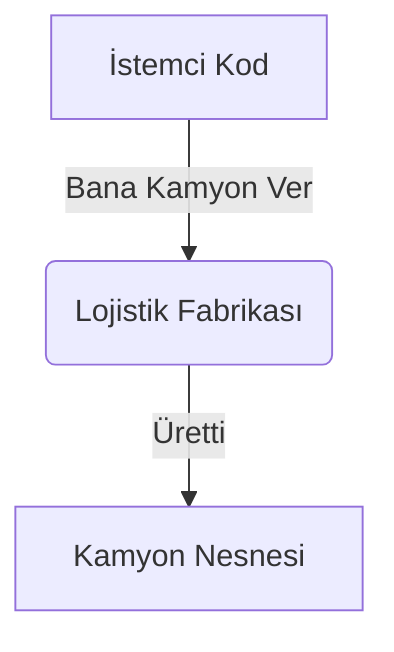

# Bölüm 02: Yaratılışsal Kalıplar (Creational Patterns)

Bu kalıplar, uygulamanızdaki sınıfların (nesnelerin) "Nasıl doğması gerektiğine" odaklanır. Sistemin her yerinde rastgele `new Araba()` yazarsanız, o arabanın üretimi değiştiğinde projenin 100 yerini değiştirmek zorunda kalırsınız.

---

## 1. Factory (Fabrika) Kalıbı
**Problem:** Sisteminizde Lojistik işleri yapıyorsunuz ve `Kamyon` nesnesi oluşturuyorsunuz. İleride deniz taşımacılığı geldi ve `Gemi` oluşturmanız gerekti. İstemci (Kodunuz) hangi aracı seçeceğini if-else'lerle boğulmadan nasıl bulacak?
**Analoji:** Bir dondurmacıya gidersiniz. Sizin dondurma makinesinin (Kalıbın) nasıl çalıştığını bilmenize gerek yoktur. Makineye (Fabrikaya) "Bana Çikolatalı ver" (Parametre) dersiniz, makine size Çikolatalı Dondurma (Nesne) üretip verir.

## 2. Builder (İnşaatçı) Kalıbı
**Problem:** Bazı nesneleri oluşturmak (üretmek) çok karmaşıktır. Bir evin 100 farklı parametresi olabilir (Havuzu var mı? Garajı var mı? 3 katlı mı?). Constructor (Yapıcı metot) içine 100 tane parametre gönderemezsiniz.
**Analoji:** Burger King'de "Kendi Menünü Yarat" ekranıdır. Hambugeri alırsınız, üstüne *Ekstra Peynir Ekle (AddCheese)*, üstüne *Ketçap Ekle (AddKetchup)* dersiniz ve en son *Üret (Build)* butonuna basarak devasa nesneyi aşama aşama kusursuzca yaratırsınız.

## 3. Singleton (Tekil) Kalıbı
**Problem:** Bazen bir sınıftan uygulama boyunca sadece ve sadece 1 tane üretilmesini, ikinci kez istenirse aynı kopyanın verilmesini istersiniz (Örn: Veritabanı bağlantı havuzu veya Log mekanizması).
**Analoji:** Bir ülkenin sadece 1 tane Cumhurbaşkanı (Singleton Nesne) olur. Hangi bakanlık (Sınıf) çağırırsa çağırsın, her zaman aynı Cumhurbaşkanı (Aynı referans) ile görüşülür. Yeni bir Cumhurbaşkanı (new Object) yaratılamaz.
*(Not: Modern mimarilerde bu kalıbı manuel yazmak yerine Dependency Injection (IoC Container) araçlarına emanet ederiz).*
